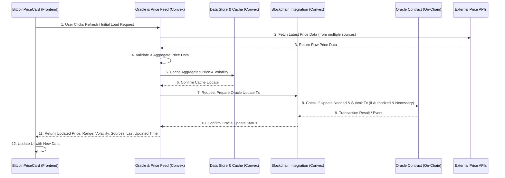

# BitHedge: Comprehensive Component Architecture

## System Architecture Overview

This document provides a comprehensive view of the BitHedge component architecture, illustrating how all components interact across the system's three main layers: Frontend, Off-Chain (Convex), and On-Chain (Smart Contracts).

## 1. High-Level System Architecture

The BitHedge system consists of three distinct layers, each with specific responsibilities:

```
┌─────────────────────────────────────────────────────────────┐
│                     FRONTEND LAYER                           │
│  ┌─────────────┐ ┌─────────────┐ ┌─────────────┐ ┌────────┐ │
│  │ Protection  │ │   Income    │ │ Protection  │ │Account │ │
│  │   Center    │ │   Center    │ │ Simulator   │ │Dashboard│ │
│  └─────────────┘ └─────────────┘ └─────────────┘ └────────┘ │
└────────────────────────────┬────────────────────────────────┘
                             │
                             ▼
┌─────────────────────────────────────────────────────────────┐
│                OFF-CHAIN LAYER (CONVEX)                      │
│  ┌─────────────┐ ┌─────────────┐ ┌─────────────┐ ┌────────┐ │
│  │   Premium   │ │  Oracle &   │ │   Policy    │ │Translation│
│  │ Calculator  │ │ Price Feed  │ │  Lifecycle  │ │  Layer   │
│  └─────────────┘ └─────────────┘ └─────────────┘ └────────┘ │
│                                                              │
│  ┌─────────────┐ ┌─────────────┐ ┌─────────────┐ ┌────────┐ │
│  │ Blockchain  │ │Wallet & Auth│ │  Data Store │ │Analytics│ │
│  │ Integration │ │  Service    │ │  & Cache    │ │ Service │ │
│  └─────────────┘ └─────────────┘ └─────────────┘ └────────┘ │
└────────────────────────────┬────────────────────────────────┘
                             │
                             ▼
┌─────────────────────────────────────────────────────────────┐
│               ON-CHAIN LAYER (SMART CONTRACTS)               │
│  ┌─────────────┐ ┌─────────────┐ ┌─────────────┐ ┌────────┐ │
│  │   Policy    │ │  Liquidity  │ │   Oracle    │ │Parameter│ │
│  │  Registry   │ │    Pool     │ │  Contract   │ │Contract │ │
│  └─────────────┘ └─────────────┘ └─────────────┘ └────────┘ │
└─────────────────────────────────────────────────────────────┘
```

## 2. Component Responsibilities & Interactions

### 2.1 Frontend Layer Components

#### Protection Center

**Responsibility**: Guides users through the process of configuring and purchasing protection policies.

**Key Interactions**:

- Calls Premium Calculator to get real-time premium quotes
- Uses Translation Layer to display insurance-friendly terminology
- Calls Oracle & Price Feed for current Bitcoin price
- Uses Blockchain Integration to prepare and submit transactions
- Connects to Policy Registry contract via transaction submission

```
┌─────────────────────────────────────────────────────────────┐
│                 Protection Center Component                  │
└───┬─────────────────┬────────────────┬────────────────┬─────┘
    │                 │                │                │
    ▼                 ▼                ▼                ▼
┌─────────┐    ┌────────────┐   ┌───────────┐   ┌────────────┐
│Premium  │    │Translation │   │Oracle &   │   │Blockchain  │
│Calculator│   │  Layer     │   │Price Feed │   │Integration │
└─────────┘    └────────────┘   └───────────┘   └────────────┘
                                                      │
                                                      ▼
                                                ┌────────────┐
                                                │  Policy    │
                                                │  Registry  │
                                                └────────────┘
```

#### Income Center

**Responsibility**: Enables users to provide protection and earn yield by configuring income strategies.

**Key Interactions**:

- Calls Premium Calculator to calculate potential yield
- Uses Translation Layer for income-focused terminology
- Uses Blockchain Integration to prepare and submit transactions
- Connects to Liquidity Pool contract for capital commitment

```
┌─────────────────────────────────────────────────────────────┐
│                   Income Center Component                    │
└───┬─────────────────┬────────────────┬────────────────┬─────┘
    │                 │                │                │
    ▼                 ▼                ▼                ▼
┌─────────┐    ┌────────────┐   ┌───────────┐   ┌────────────┐
│Premium  │    │Translation │   │Oracle &   │   │Blockchain  │
│Calculator│   │  Layer     │   │Price Feed │   │Integration │
└─────────┘    └────────────┘   └───────────┘   └────────────┘
                                                      │
                                                      ▼
                                                ┌────────────┐
                                                │ Liquidity  │
                                                │   Pool     │
                                                └────────────┘
```

#### Protection Simulator

**Responsibility**: Simulates protection outcomes under different market scenarios.

**Key Interactions**:

- Calls Premium Calculator for scenario analysis
- Uses Oracle & Price Feed for historical price data
- Uses Translation Layer for insurance-friendly explanations

```
┌─────────────────────────────────────────────────────────────┐
│                 Protection Simulator Component               │
└───┬─────────────────┬────────────────┬─────────────────┬────┘
    │                 │                │                 │
    ▼                 ▼                ▼                 ▼
┌─────────┐    ┌────────────┐   ┌───────────┐    ┌────────────┐
│Premium  │    │Translation │   │Oracle &   │    │ Analytics  │
│Calculator│   │  Layer     │   │Price Feed │    │  Service   │
└─────────┘    └────────────┘   └───────────┘    └────────────┘
```

#### Account Dashboard

**Responsibility**: Displays user's active policies, portfolio, and account information.

**Key Interactions**:

- Uses Policy Lifecycle to track policy status
- Calls Oracle & Price Feed for current prices
- Uses Analytics Service for portfolio insights
- Uses Blockchain Integration to monitor transactions

```
┌─────────────────────────────────────────────────────────────┐
│                  Account Dashboard Component                 │
└───┬─────────────────┬────────────────┬────────────────┬─────┘
    │                 │                │                │
    ▼                 ▼                ▼                ▼
┌─────────┐    ┌────────────┐   ┌───────────┐   ┌────────────┐
│Policy   │    │Oracle &    │   │Analytics  │   │Blockchain  │
│Lifecycle│    │Price Feed  │   │Service    │   │Integration │
└─────────┘    └────────────┘   └───────────┘   └────────────┘
```

### 2.2 Off-Chain Layer Components (Convex)

#### Premium Calculator

**Responsibility**: Performs complex options pricing calculations and simulations.

**Key Interactions**:

- Receives parameters from frontend components
- Calls Oracle & Price Feed for price and volatility data
- Uses Parameter Contract for premium calculation parameters
- Returns premium calculations and simulation results to frontend
- Provides simplified verification functions for on-chain contracts

```
┌─────────────────────────────────────────────────────────────┐
│                 Premium Calculator Component                 │
└───┬─────────────────┬────────────────┬────────────────┬─────┘
    │                 │                │                │
    ▼                 ▼                ▼                ▼
┌─────────┐    ┌────────────┐   ┌───────────┐   ┌────────────┐
│Oracle & │    │Data Store  │   │Parameter  │   │Policy      │
│Price Feed│   │& Cache     │   │Contract   │   │Registry    │
└─────────┘    └────────────┘   └───────────┘   └────────────┘
```

#### Oracle & Price Feed

**Responsibility**: Aggregates, validates, and provides price data from multiple sources.

**Key Interactions**:

- Fetches data from external price APIs
- Stores historical price data in Data Store
- Provides price data to Premium Calculator and frontend components
- Periodically updates Oracle Contract with verified prices
- Calculates volatility metrics for premium calculations

```
┌─────────────────────────────────────────────────────────────┐
│                 Oracle & Price Feed Component                │
└───┬─────────────────┬────────────────┬────────────────┬─────┘
    │                 │                │                │
    ▼                 ▼                ▼                ▼
┌─────────┐    ┌────────────┐   ┌───────────┐   ┌────────────┐
│External │    │Data Store  │   │Oracle     │   │Blockchain  │
│Price APIs│   │& Cache     │   │Contract   │   │Integration │
└─────────┘    └────────────┘   └───────────┘   └────────────┘
```

#### Policy Lifecycle

**Responsibility**: Manages the complete lifecycle of protection policies.

**Key Interactions**:

- Monitors Policy Registry for policy events
- Tracks policy status and expirations
- Notifies frontend of status changes
- Calls Oracle & Price Feed to check activation conditions
- Uses Blockchain Integration to prepare activation transactions

```
┌─────────────────────────────────────────────────────────────┐
│                 Policy Lifecycle Component                   │
└───┬─────────────────┬────────────────┬────────────────┬─────┘
    │                 │                │                │
    ▼                 ▼                ▼                ▼
┌─────────┐    ┌────────────┐   ┌───────────┐   ┌────────────┐
│Policy   │    │Oracle &    │   │Data Store │   │Blockchain  │
│Registry │    │Price Feed  │   │& Cache    │   │Integration │
└─────────┘    └────────────┘   └───────────┘   └────────────┘
```

#### Translation Layer

**Responsibility**: Transforms technical options terminology into Bitcoin-native insurance concepts.

**Key Interactions**:

- Provides terminology mapping to frontend components
- Stores user terminology preferences in Data Store
- Generates explanations of technical concepts
- Adapts based on user persona (protection buyer vs. income provider)

```
┌─────────────────────────────────────────────────────────────┐
│                  Translation Layer Component                 │
└───┬─────────────────┬────────────────┬────────────────┬─────┘
    │                 │                │                │
    ▼                 ▼                ▼                ▼
┌─────────┐    ┌────────────┐   ┌───────────┐   ┌────────────┐
│Frontend │    │Data Store  │   │Wallet &   │   │Premium     │
│Components│   │& Cache     │   │Auth Service│  │Calculator  │
└─────────┘    └────────────┘   └───────────┘   └────────────┘
```

#### Blockchain Integration

**Responsibility**: Bridges between the off-chain services and on-chain smart contracts.

**Key Interactions**:

- Prepares transactions for frontend components
- Monitors blockchain for events and transactions
- Updates Data Store with blockchain state
- Interacts with all smart contracts
- Provides transaction status updates to frontend

```
┌─────────────────────────────────────────────────────────────┐
│                Blockchain Integration Component              │
└───┬─────────────────┬────────────────┬────────────────┬─────┘
    │                 │                │                │
    ▼                 ▼                ▼                ▼
┌─────────┐    ┌────────────┐   ┌───────────┐   ┌────────────┐
│Policy   │    │Liquidity   │   │Oracle     │   │Parameter   │
│Registry │    │Pool        │   │Contract   │   │Contract    │
└─────────┘    └────────────┘   └───────────┘   └────────────┘
    ▲                ▲               ▲                ▲
    │                │               │                │
    └────────────────┴───────────────┴────────────────┘
                             │
                             ▼
                      ┌────────────┐
                      │Data Store  │
                      │& Cache     │
                      └────────────┘
```

#### Wallet & Auth Service

**Responsibility**: Manages wallet connections and user authentication.

**Key Interactions**:

- Authenticates users via wallet connection
- Maintains user sessions in Convex
- Provides authenticated context to other components
- Stores user preferences and settings

```
┌─────────────────────────────────────────────────────────────┐
│                 Wallet & Auth Service Component              │
└───┬─────────────────┬────────────────┬────────────────┬─────┘
    │                 │                │                │
    ▼                 ▼                ▼                ▼
┌─────────┐    ┌────────────┐   ┌───────────┐   ┌────────────┐
│Frontend │    │Data Store  │   │Blockchain │   │Translation │
│Components│   │& Cache     │   │Integration│   │Layer       │
└─────────┘    └────────────┘   └───────────┘   └────────────┘
```

#### Data Store & Cache

**Responsibility**: Stores and manages application data and provides caching mechanisms.

**Key Interactions**:

- Stores policy data, user preferences, and transaction history
- Caches price data and premium calculations
- Provides data to all other components
- Ensures consistency between off-chain and on-chain state

```
┌─────────────────────────────────────────────────────────────┐
│                 Data Store & Cache Component                 │
└───┬─────────────────┬────────────────┬────────────────┬─────┘
    │                 │                │                │
    ▼                 ▼                ▼                ▼
┌─────────┐    ┌────────────┐   ┌───────────┐   ┌────────────┐
│Blockchain│   │Policy      │   │Oracle &   │   │All Other   │
│Integration│  │Lifecycle   │   │Price Feed │   │Components  │
└─────────┘    └────────────┘   └───────────┘   └────────────┘
```

#### Analytics Service

**Responsibility**: Analyzes user data, policy performance, and market trends.

**Key Interactions**:

- Processes data from Data Store
- Provides insights to frontend dashboard
- Analyzes protection and income strategies
- Tracks platform usage metrics

```
┌─────────────────────────────────────────────────────────────┐
│                  Analytics Service Component                 │
└───┬─────────────────┬────────────────┬────────────────┬─────┘
    │                 │                │                │
    ▼                 ▼                ▼                ▼
┌─────────┐    ┌────────────┐   ┌───────────┐   ┌────────────┐
│Data Store│   │Oracle &    │   │Policy     │   │Frontend    │
│& Cache   │   │Price Feed  │   │Lifecycle  │   │Components  │
└─────────┘    └────────────┘   └───────────┘   └────────────┘
```

### 2.3 On-Chain Layer Components (Smart Contracts)

#### Policy Registry Contract

**Responsibility**: Maintains the authoritative record of all protection policies.

**Key Interactions**:

- Receives policy creation transactions from users
- Calls Liquidity Pool for collateral checks
- Uses Oracle Contract for price data
- References Parameter Contract for system parameters
- Emits events for off-chain monitoring

```
┌─────────────────────────────────────────────────────────────┐
│                 Policy Registry Contract                     │
└───┬─────────────────┬────────────────┬────────────────┬─────┘
    │                 │                │                │
    ▼                 ▼                ▼                ▼
┌─────────┐    ┌────────────┐   ┌───────────┐   ┌────────────┐
│Liquidity│    │Oracle      │   │Parameter  │   │Blockchain  │
│Pool     │    │Contract    │   │Contract   │   │Events      │
└─────────┘    └────────────┘   └───────────┘   └────────────┘
```

#### Liquidity Pool Contract

**Responsibility**: Manages collateral for protection policies in the assisted counterparty model.

**Key Interactions**:

- Receives deposits and withdrawal transactions
- Provides collateral for Policy Registry
- Calls Oracle Contract for price data
- References Parameter Contract for risk parameters
- Emits events for off-chain monitoring

```
┌─────────────────────────────────────────────────────────────┐
│                  Liquidity Pool Contract                     │
└───┬─────────────────┬────────────────┬────────────────┬─────┘
    │                 │                │                │
    ▼                 ▼                ▼                ▼
┌─────────┐    ┌────────────┐   ┌───────────┐   ┌────────────┐
│Policy   │    │Oracle      │   │Parameter  │   │Blockchain  │
│Registry │    │Contract    │   │Contract   │   │Events      │
└─────────┘    └────────────┘   └───────────┘   └────────────┘
```

#### Oracle Contract

**Responsibility**: Provides trusted price data to other contracts.

**Key Interactions**:

- Receives price updates from authorized sources
- Provides price data to Policy Registry and Liquidity Pool
- Maintains limited price history
- Emits events on price updates

```
┌─────────────────────────────────────────────────────────────┐
│                    Oracle Contract                           │
└───┬─────────────────┬────────────────┬────────────────┬─────┘
    │                 │                │                │
    ▼                 ▼                ▼                ▼
┌─────────┐    ┌────────────┐   ┌───────────┐   ┌────────────┐
│Policy   │    │Liquidity   │   │Parameter  │   │Blockchain  │
│Registry │    │Pool        │   │Contract   │   │Events      │
└─────────┘    └────────────┘   └───────────┘   └────────────┘
```

#### Parameter Contract

**Responsibility**: Manages system-wide parameters and configuration settings.

**Key Interactions**:

- Provides parameters to all other contracts
- Receives updates from authorized administrators
- Emits events on parameter changes

```
┌─────────────────────────────────────────────────────────────┐
│                   Parameter Contract                         │
└───┬─────────────────┬────────────────┬────────────────┬─────┘
    │                 │                │                │
    ▼                 ▼                ▼                ▼
┌─────────┐    ┌────────────┐   ┌───────────┐   ┌────────────┐
│Policy   │    │Liquidity   │   │Oracle     │   │Blockchain  │
│Registry │    │Pool        │   │Contract   │   │Events      │
└─────────┘    └────────────┘   └───────────┘   └────────────┘
```

## 3. Cross-Layer Interactions & Data Flows

### 3.1 Protection Policy Creation Flow

This sequence shows the complete flow of creating a protection policy, illustrating how components interact across all three layers:

```
┌───────────┐     ┌───────────┐     ┌────────────┐     ┌────────────┐     ┌────────────┐     ┌────────────┐
│Protection │     │Premium    │     │Oracle &    │     │Blockchain  │     │Policy      │     │Liquidity   │
│Center     │     │Calculator │     │Price Feed  │     │Integration │     │Registry    │     │Pool        │
│(Frontend) │     │(Convex)   │     │(Convex)    │     │(Convex)    │     │(Contract)  │     │(Contract)  │
└─────┬─────┘     └─────┬─────┘     └─────┬──────┘     └─────┬──────┘     └─────┬──────┘     └─────┬──────┘
      │                 │                 │                  │                  │                  │
      │ 1. Adjust       │                 │                  │                  │                  │
      │ Parameters      │                 │                  │                  │                  │
      │                 │                 │                  │                  │                  │
      │ 2. Request      │                 │                  │                  │                  │
      │ Premium Quote   │                 │                  │                  │                  │
      │────────────────>│                 │                  │                  │                  │
      │                 │ 3. Get Current  │                  │                  │                  │
      │                 │ Price & Vol     │                  │                  │                  │
      │                 │────────────────>│                  │                  │                  │
      │                 │                 │                  │                  │                  │
      │                 │ 4. Return Price │                  │                  │                  │
      │                 │ & Volatility    │                  │                  │                  │
      │                 │<────────────────│                  │                  │                  │
      │                 │                 │                  │                  │                  │
      │                 │ 5. Calculate    │                  │                  │                  │
      │                 │ Premium         │                  │                  │                  │
      │                 │                 │                  │                  │                  │
      │ 6. Return       │                 │                  │                  │                  │
      │ Premium Quote    │                 │                  │                  │                  │
      │<────────────────│                 │                  │                  │                  │
      │                 │                 │                  │                  │                  │
      │ 7. User         │                 │                  │                  │                  │
      │ Confirms        │                 │                  │                  │                  │
      │                 │                 │                  │                  │                  │
      │ 8. Request      │                 │                  │                  │                  │
      │ Transaction     │                 │                  │                  │                  │
      │────────────────────────────────────────────────────>│                  │                  │
      │                 │                 │                  │                  │                  │
      │                 │                 │                  │ 9. Prepare       │                  │
      │                 │                 │                  │ Transaction      │                  │
      │                 │                 │                  │ Parameters       │                  │
      │                 │                 │                  │                  │                  │
      │ 10. Return      │                 │                  │                  │                  │
      │ Transaction     │                 │                  │                  │                  │
      │ Object          │                 │                  │                  │                  │
      │<────────────────────────────────────────────────────│                  │                  │
      │                 │                 │                  │                  │                  │
      │ 11. User Signs  │                 │                  │                  │                  │
      │ Transaction     │                 │                  │                  │                  │
      │                 │                 │                  │                  │                  │
      │ 12. Submit      │                 │                  │                  │                  │
      │ Transaction     │                 │                  │                  │                  │
      │─────────────────────────────────────────────────────────────────────────────────────────>│
      │                 │                 │                  │                  │                  │
      │                 │                 │                  │                  │ 13. Create       │
      │                 │                 │                  │                  │ Policy           │
      │                 │                 │                  │                  │                  │
      │                 │                 │                  │                  │ 14. Check        │
      │                 │                 │                  │                  │ Collateral       │
      │                 │                 │                  │                  │────────────────>│
      │                 │                 │                  │                  │                  │
      │                 │                 │                  │                  │ 15. Confirm      │
      │                 │                 │                  │                  │ Collateral       │
      │                 │                 │                  │                  │<────────────────│
      │                 │                 │                  │                  │                  │
      │                 │                 │                  │                  │ 16. Emit         │
      │                 │                 │                  │                  │ Policy           │
      │                 │                 │                  │                  │ Created Event    │
      │                 │                 │                  │                  │                  │
      │                 │                 │                  │ 17. Detect       │                  │
      │                 │                 │                  │ Policy Event     │                  │
      │                 │                 │                  │<─────────────────│                  │
      │                 │                 │                  │                  │                  │
      │                 │                 │                  │ 18. Update       │                  │
      │                 │                 │                  │ Policy Status    │                  │
      │                 │                 │                  │ in Convex        │                  │
      │                 │                 │                  │                  │                  │
      │ 19. Update UI   │                 │                  │                  │                  │
      │ with Success    │                 │                  │                  │                  │
      │<────────────────────────────────────────────────────│                  │                  │
      │                 │                 │                  │                  │                  │
```

### 3.2 Policy Activation Flow

This sequence shows how a policy gets activated when Bitcoin price falls below the protected value:

```
┌───────────┐    ┌───────────┐    ┌────────────┐    ┌────────────┐    ┌────────────┐    ┌────────────┐
│Account    │    │Policy     │    │Oracle &    │    │Blockchain  │    │Policy      │    │Liquidity   │
│Dashboard  │    │Lifecycle  │    │Price Feed  │    │Integration │    │Registry    │    │Pool        │
│(Frontend) │    │(Convex)   │    │(Convex)    │    │(Convex)    │    │(Contract)  │    │(Contract)  │
└─────┬─────┘    └─────┬─────┘    └─────┬──────┘    └─────┬──────┘    └─────┬──────┘    └─────┬──────┘
      │                │                │                 │                 │                 │
      │                │ 1. Monitor     │                 │                 │                 │
      │                │ Price Data     │                 │                 │                 │
      │                │────────────────>                 │                 │                 │
      │                │                │                 │                 │                 │
      │                │ 2. Return      │                 │                 │                 │
      │                │ Price Drop     │                 │                 │                 │
      │                │<────────────────                 │                 │                 │
      │                │                │                 │                 │                 │
      │                │ 3. Detect      │                 │                 │                 │
      │                │ Activation     │                 │                 │                 │
      │                │ Condition      │                 │                 │                 │
      │                │                │                 │                 │                 │
      │                │ 4. Prepare     │                 │                 │                 │
      │                │ Activation     │                 │                 │                 │
      │                │ Transaction    │                 │                 │                 │
      │                │────────────────────────────────>│                 │                 │
      │                │                │                 │                 │                 │
      │ 5. Notify      │                │                 │                 │                 │
      │ User of        │                │                 │                 │                 │
      │ Activation     │                │                 │                 │                 │
      │ Opportunity    │                │                 │                 │                 │
      │<───────────────│                │                 │                 │                 │
      │                │                │                 │                 │                 │
      │ 6. User        │                │                 │                 │                 │
      │ Confirms       │                │                 │                 │                 │
      │ Activation     │                │                 │                 │                 │
      │────────────────────────────────────────────────>│                 │                 │
      │                │                │                 │                 │                 │
      │                │                │                 │ 7. Submit       │                 │
      │                │                │                 │ Activation      │                 │
      │                │                │                 │ Transaction     │                 │
      │                │                │                 │────────────────>                 │
      │                │                │                 │                 │                 │
      │                │                │                 │                 │ 8. Process      │
      │                │                │                 │                 │ Activation      │
      │                │                │                 │                 │                 │
      │                │                │                 │                 │ 9. Transfer     │
      │                │                │                 │                 │ Protected       │
      │                │                │                 │                 │ Value           │
      │                │                │                 │                 │────────────────>
      │                │                │                 │                 │                 │
      │                │                │                 │                 │ 10. Release     │
      │                │                │                 │                 │ Funds           │
      │                │                │                 │                 │<────────────────
      │                │                │                 │                 │                 │
      │                │                │                 │                 │ 11. Emit        │
      │                │                │                 │                 │ Policy          │
      │                │                │                 │                 │ Activated       │
      │                │                │                 │                 │ Event           │
      │                │                │                 │                 │                 │
      │                │                │                 │ 12. Detect      │                 │
      │                │                │                 │ Activation      │                 │
      │                │                │                 │ Event           │                 │
      │                │                │                 │<────────────────                 │
      │                │                │                 │                 │                 │
      │                │ 13. Update     │                 │                 │                 │
      │                │ Policy Status  │                 │                 │                 │
      │                │<────────────────────────────────│                 │                 │
      │                │                │                 │                 │                 │
      │ 14. Update UI  │                │                 │                 │                 │
      │ with Activation│                │                 │                 │                 │
      │ Success        │                │                 │                 │                 │
      │<───────────────│                │                 │                 │                 │
      │                │                │                 │                 │                 │
```

### 3.3 Bitcoin Price Card Data Fetch Flow

This sequence shows how the `BitcoinPriceCard` component fetches updated price information:



**Bitcoin Price Card Data Fetch Flow (Text Version):**

1.  **Frontend (BitcoinPriceCard) -> Convex (Oracle & Price Feed):** User clicks "Refresh" or the component performs its initial data load, triggering a request for updated price feed data.
2.  **Convex (Oracle & Price Feed) -> External Price APIs:** The Oracle service queries multiple external APIs to get the latest raw Bitcoin price data.
3.  **External Price APIs -> Convex (Oracle & Price Feed):** External APIs return the raw price data.
4.  **Convex (Oracle & Price Feed):** Internally validates the received data (checking for outliers, freshness) and aggregates it into a single reliable price point and calculates derived metrics like volatility.
5.  **Convex (Oracle & Price Feed) -> Convex (Data Store & Cache):** Stores the validated, aggregated price, volatility, and source information in the cache for faster subsequent reads.
6.  **Convex (Data Store & Cache) -> Convex (Oracle & Price Feed):** Confirms the data has been successfully cached.
7.  **Convex (Oracle & Price Feed) -> Convex (Blockchain Integration):** Requests the Blockchain Integration service to prepare a transaction to potentially update the on-chain Oracle contract (if the price deviation exceeds a threshold and the service is authorized).
8.  **Convex (Blockchain Integration) -> On-Chain (Oracle Contract):** Checks if an update is necessary based on configured rules and submits the update transaction if required and authorized.
9.  **On-Chain (Oracle Contract) -> Convex (Blockchain Integration):** The contract emits an event or the transaction result indicates success/failure of the update.
10. **Convex (Blockchain Integration) -> Convex (Oracle & Price Feed):** Confirms the status of the on-chain Oracle update attempt.
11. **Convex (Oracle & Price Feed) -> Frontend (BitcoinPriceCard):** Returns the latest aggregated data (current price, 24h range, volatility, active source count, last update timestamp) to the frontend component.
12. **Frontend (BitcoinPriceCard):** Updates its state and re-renders the UI to display the newly fetched data.

```
┌───────────────┐    ┌─────────────────┐    ┌────────────┐    ┌────────────┐    ┌────────────┐    ┌─────────────────┐
│BitcoinPriceCard│   │Oracle & Price   │   │External    │   │Data Store  │   │Blockchain  │   │Oracle Contract  │
│(Frontend)     │   │Feed (Convex)    │   │Price APIs  │   │& Cache     │   │Integration │   │(On-Chain)     │
└───────┬───────┘   └────────┬────────┘   └─────┬──────┘   └─────┬──────┘   └─────┬──────┘   └────────┬────────┘
        │                    │                  │                │                │                   │
        │ 1. Request Data    │                  │                │                │                   │
        │ (Load/Refresh)     │                  │                │                │                   │
        │───────────────────>│                  │                │                │                   │
        │                    │ 2. Fetch Latest  │                │                │                   │
        │                    │ Price Data       │                │                │                   │
        │                    │─────────────────>│                │                │                   │
        │                    │                  │ 3. Return Raw  │                │                   │
        │                    │                  │ Price Data     │                │                   │
        │                    │<─────────────────│                │                │                   │
        │                    │                  │                │                │                   │
        │                    │ 4. Validate &    │                │                │                   │
        │                    │ Aggregate        │                │                │                   │
        │                    │                  │                │                │                   │
        │                    │ 5. Cache         │                │                │                   │
        │                    │ Aggregated Data  │                │                │                   │
        │                    │──────────────────────────────────>│                │                   │
        │                    │                  │                │ 6. Confirm     │                   │
        │                    │                  │                │ Cache Update   │                   │
        │                    │<──────────────────────────────────│                │                   │
        │                    │                  │                │                │                   │
        │                    │ 7. Request Oracle│                │                │                   │
        │                    │ Update Tx Prep   │                │                │                   │
        │                    │──────────────────────────────────────────────────>│                   │
        │                    │                  │                │                │ 8. Prepare &      │
        │                    │                  │                │                │ Submit Tx (If Nec.)│
        │                    │                  │                │                │──────────────────>│
        │                    │                  │                │                │                   │ 9. Tx Result /
        │                    │                  │                │                │                   │ Event
        │                    │                  │                │                │<──────────────────│
        │                    │                  │                │                │ 10. Confirm       │
        │                    │                  │                │                │ Oracle Update     │
        │                    │                  │                │                │ Status            │
        │                    │<──────────────────────────────────────────────────│                   │
        │                    │                  │                │                │                   │
        │ 11. Return Updated │                  │                │                │                   │
        │ Data to UI         │                  │                │                │                   │
        │<───────────────────│                  │                │                │                   │
        │                    │                  │                │                │                   │
        │ 12. Update UI      │                  │                │                │                   │
        │                    │                  │                │                │                   │
```

### 3.4 Income Provision Flow (Placeholder)

_(Diagram and description for the Income Center flow, where users provide liquidity, will be added here.)_

## 4. Component-Specific Data Models

### 4.1 Policy Registry Contract Data Model

```clarity
;; Policy Types: "PUT" or "CALL"
;; Status: 0=active, 1=exercised, 2=expired, 3=canceled

(define-map policies
  { policy-id: uint }
  {
    owner: principal,
    protected-value: uint, ;; strike price in STX satoshis
    expiration-height: uint,
    protected-amount: uint, ;; in Bitcoin satoshis
    premium: uint, ;; in STX satoshis
    policy-type: (string-ascii 4),
    counterparty: principal, ;; liquidity pool or direct provider
    creation-height: uint,
    status: uint,
    exercise-price: uint, ;; price at exercise if activated
    exercise-height: uint ;; block when exercised, 0 if not exercised
  }
)

;; Track policies by owner
(define-map policies-by-owner
  { owner: principal }
  { policy-ids: (list 250 uint) }
)
```

### 4.2 Convex Policy Data Model

```typescript
// Convex schema for policies table
export default defineSchema({
  policies: defineTable({
    owner: v.string(),
    protectedValue: v.number(), // USD value
    protectedAmount: v.number(), // BTC amount
    expirationTime: v.number(), // Timestamp
    premium: v.number(), // USD value
    policyType: v.string(), // "PUT" or "CALL"
    status: v.number(), // 0=active, 1=exercised, 2=expired, 3=canceled
    creationTime: v.number(), // Timestamp
    transactionId: v.optional(v.string()), // Stacks transaction ID
    contractPolicyId: v.optional(v.number()), // On-chain policy ID
    exercisePrice: v.optional(v.number()), // Price at exercise
    exerciseTime: v.optional(v.number()), // Timestamp of exercise
    // Additional fields for UX enhancement
    displayName: v.optional(v.string()), // User-friendly policy name
    notes: v.optional(v.string()), // User notes
    notificationPreferences: v.optional(
      v.object({
        priceAlerts: v.boolean(),
        expirationReminders: v.boolean(),
        activationOpportunities: v.boolean(),
      })
    ),
  })
    .index("by_owner", ["owner"])
    .index("by_status", ["status"])
    .index("by_expiration", ["expirationTime"]),
});
```

### 4.3 Premium Calculation Data Model

```typescript
// Parameters for premium calculation
interface PremiumCalculationParams {
  protectedValue: number; // Strike price in USD
  protectedAmount: number; // Amount of BTC to protect
  expirationDays: number; // Days until expiration
  policyType: "PUT" | "CALL"; // Option type
  currentPrice?: number; // Current BTC price (fetched if not provided)
  volatility?: number; // Historical volatility (calculated if not provided)
}

// Premium calculation result
interface PremiumCalculationResult {
  premium: number; // Cost in USD
  premiumPercentage: number; // As percentage of protected value
  annualizedPremium: number; // Annualized percentage
  breakEvenPrice: number; // Price at which protection has zero net value
  maxBenefit: number; // Maximum potential value of protection
  scenarios: {
    // Price scenarios
    price: number;
    protectionValue: number;
    netValue: number;
  }[];
  factorsBreakdown: {
    // Component factors
    intrinsicValue: number;
    timeValue: number;
    volatilityImpact: number;
  };
}
```

## 5. Implementation Guidance for Key Components

### 5.1 Convex Premium Calculator Implementation

```typescript
// Simplified Black-Scholes implementation for Convex
export const query.calculatePremium = query(
  async ({
    db
  }, {
    protectedValue,
    protectedAmount,
    expirationDays,
    policyType
  }: PremiumCalculationParams): Promise<PremiumCalculationResult> => {

    // Get current BTC price
    const currentPrice = await getCurrentBtcPrice(db);

    // Calculate time factor (in years)
    const timeYears = expirationDays / 365;

    // Get historical volatility
    const volatility = await getHistoricalVolatility(db, 30); // 30-day historical vol

    // Calculate premium using Black-Scholes algorithm
    // This is a simplified version - full implementation would use complete B-S formula
    let premium;

    if (policyType === "PUT") {
      // For PUT options (downside protection)
      const intrinsicValue = Math.max(0, protectedValue - currentPrice);
      const timeValue = calculateTimeValue(currentPrice, protectedValue, timeYears, volatility);
      premium = (intrinsicValue + timeValue) * protectedAmount;
    } else {
      // For CALL options (upside protection)
      const intrinsicValue = Math.max(0, currentPrice - protectedValue);
      const timeValue = calculateTimeValue(currentPrice, protectedValue, timeYears, volatility);
      premium = (intrinsicValue + timeValue) * protectedAmount;
    }

    // Calculate premium as percentage of protected value
    const premiumPercentage = (premium / (protectedValue * protectedAmount)) * 100;

    // Calculate annualized premium
    const annualizedPremium = premiumPercentage * (365 / expirationDays);

    // Calculate break-even price
    const breakEvenPrice = policyType === "PUT"
      ? protectedValue - (premium / protectedAmount)
      : protectedValue + (premium / protectedAmount);

    // Calculate maximum benefit
    const maxBenefit = policyType === "PUT"
      ? protectedAmount * protectedValue // Assuming price drops to zero
      : Number.POSITIVE_INFINITY; // Unlimited upside for CALL

    // Generate price scenarios
    const scenarios = generatePriceScenarios(currentPrice, protectedValue, protectedAmount, premium, policyType);

    // Prepare factors breakdown
    const factorsBreakdown = {
      intrinsicValue: policyType === "PUT"
        ? Math.max(0, protectedValue - currentPrice) * protectedAmount
        : Math.max(0, currentPrice - protectedValue) * protectedAmount,
      timeValue: premium - (factorsBreakdown.intrinsicValue || 0),
      volatilityImpact: calculateVolatilityImpact(volatility, timeYears, currentPrice, protectedValue, protectedAmount)
    };

    return {
      premium,
      premiumPercentage,
      annualizedPremium,
      breakEvenPrice,
      maxBenefit,
      scenarios,
      factorsBreakdown
    };
  }
);
```

### 5.2 Smart Contract Premium Function Implementation

```clarity
;; Simplified premium calculation function in Clarity
(define-read-only (calculate-premium
  (protected-value uint)
  (expiration-height uint)
  (protected-amount uint)
  (policy-type (string-ascii 4))
)
  (let (
    (current-price (unwrap-panic (get-current-btc-price)))
    (time-factor (/ (- expiration-height block-height) u144)) ;; Convert to days
    (moneyness (if (is-eq policy-type "PUT")
                (/ (* u1000000 (- current-price protected-value)) current-price)
                (/ (* u1000000 (- protected-value current-price)) current-price)))
    (params (unwrap-panic (map-get? policy-risk-parameters { policy-type: policy-type })))
    (base-rate (get base-premium-rate params))
    (utilization-factor (+ u1000000 (/ (* (get utilization-multiplier params) pool-utilization-rate) u1000000)))
    (moneyness-factor (+ u1000000 (/ (* (get moneyness-multiplier params) moneyness) u1000000)))
    (time-factor-adj (+ u1000000 (/ (* (get duration-multiplier params) time-factor) u1000000)))
    (volatility-factor (unwrap-panic (get-volatility-factor)))

    ;; Combined premium calculation (simplified for smart contract efficiency)
    (premium-rate (/ (* (* (* base-rate utilization-factor) moneyness-factor) time-factor-adj) u1000000000000))
    (premium-amount (/ (* protected-amount premium-rate) u1000000))
  )
  premium-amount)
)
```

## 6. Unified Component Architecture Diagram

This comprehensive diagram shows how all components interact across the three layers:

```
┌─────────────────────────────────────────────────────────────────────────────────────────────────────────────────┐
│                                                FRONTEND LAYER                                                    │
│                                                                                                                  │
│  ┌─────────────────┐             ┌─────────────────┐             ┌─────────────────┐       ┌─────────────────┐  │
│  │   Protection    │             │     Income      │             │   Protection    │       │     Account     │  │
│  │     Center      ├─────┬───────┤     Center      ├─────┬───────┤    Simulator    ├───────┤    Dashboard    │  │
│  └─────────────────┘     │       └─────────────────┘     │       └─────────────────┘       └─────────────────┘  │
│                          │                               │                                                       │
└──────────────────────────┼───────────────────────────────┼───────────────────────────────────────────────────────┘
                           │                               │
                           ▼                               ▼
┌──────────────────────────────────────────────────────────────────────────────────────────────────────────────────┐
│                                              OFF-CHAIN LAYER (CONVEX)                                             │
│                                                                                                                   │
│  ┌─────────────────┐    ┌─────────────────┐    ┌─────────────────┐    ┌─────────────────┐    ┌─────────────────┐ │
│  │    Premium      │◄──►│    Oracle &     │◄──►│     Policy      │◄──►│   Translation   │◄──►│  Wallet & Auth  │ │
│  │   Calculator    │    │   Price Feed    │    │    Lifecycle    │    │      Layer      │    │     Service     │ │
│  └────────┬────────┘    └────────┬────────┘    └────────┬────────┘    └────────┬────────┘    └────────┬────────┘ │
│           │                      │                      │                      │                      │           │
│           │                      │                      │                      │                      │           │
│           ▼                      ▼                      ▼                      ▼                      ▼           │
│  ┌─────────────────┐    ┌─────────────────┐    ┌─────────────────┐    ┌─────────────────┐    ┌─────────────────┐ │
│  │   Blockchain    │◄──►│   Data Store    │◄──►│    Analytics    │◄──►│External APIs &  │◄──►│    Scheduled    │ │
│  │   Integration   │    │    & Cache      │    │     Service     │    │    Services     │    │      Tasks      │ │
│  └────────┬────────┘    └─────────────────┘    └─────────────────┘    └─────────────────┘    └─────────────────┘ │
│           │                                                                                                       │
└───────────┼───────────────────────────────────────────────────────────────────────────────────────────────────────┘
            │
            ▼
┌───────────────────────────────────────────────────────────────────────────────────────────────────────────────────┐
│                                         ON-CHAIN LAYER (SMART CONTRACTS)                                           │
│                                                                                                                    │
│  ┌─────────────────┐             ┌─────────────────┐             ┌─────────────────┐       ┌─────────────────┐    │
│  │     Policy      │◄───────────►│    Liquidity    │◄───────────►│     Oracle      │◄─────►│    Parameter    │    │
│  │    Registry     │             │      Pool       │             │    Contract     │       │    Contract     │    │
│  └─────────────────┘             └─────────────────┘             └─────────────────┘       └─────────────────┘    │
│                                                                                                                    │
└────────────────────────────────────────────────────────────────────────────────────────────────────────────────────┘
```

## 7. Key Data Flows & Processing Boundaries

### 7.1 On-Chain vs. Off-Chain Processing Division

| Functionality          | On-Chain Implementation                    | Off-Chain Implementation                            | Rationale                                                       |
| ---------------------- | ------------------------------------------ | --------------------------------------------------- | --------------------------------------------------------------- |
| Premium Calculation    | Simplified formula with limited factors    | Full Black-Scholes with complete volatility surface | Complex calculations are expensive on-chain                     |
| Price Oracle           | Simple price storage with basic validation | Multi-source aggregation with advanced filtering    | On-chain storage should be minimal and verified                 |
| Policy Lifecycle       | Core state transitions only                | Enhanced monitoring and notification                | State must be authoritative on-chain, UX enhancements off-chain |
| Parameter Management   | Critical protocol parameters               | User preferences and UI settings                    | Protocol parameters need consensus, preferences don't           |
| Transaction Processing | Final settlement and state changes         | Preparation and monitoring                          | Blockchain handles settlement, off-chain handles UX             |
| Collateral Management  | Lock and release operations                | Monitoring and recommendations                      | On-chain guarantees are essential for trust                     |
| Data Analytics         | None                                       | Comprehensive analytics                             | Analytics are computationally intensive                         |

### 7.2 Critical Integration Points

| Integration Point               | Connected Components                      | Primary Data Flow                        | Implementation Consideration                                 |
| ------------------------------- | ----------------------------------------- | ---------------------------------------- | ------------------------------------------------------------ |
| Frontend → Convex               | React components to Convex functions      | User inputs, UI updates                  | Use Convex React hooks for real-time updates                 |
| Convex → Blockchain             | Blockchain Integration to Smart Contracts | Transaction submission, event monitoring | Implement robust event listeners with retry logic            |
| Smart Contract → Smart Contract | Policy Registry to Liquidity Pool         | Policy creation, collateral checks       | Use clear contract interfaces with proper error handling     |
| Oracle Updates                  | Oracle & Price Feed to Oracle Contract    | Verified price data                      | Implement threshold signing for security                     |
| User Authentication             | Wallet & Auth Service to Frontend         | User identity, session management        | Use wallet-based authentication with proper session handling |
| Policy Status Updates           | Policy Registry to Policy Lifecycle       | Events, state changes                    | Ensure event capture reliability                             |
| Premium Calculations            | Premium Calculator to Policy Registry     | Verified premium amounts                 | Ensure calculation consistency between layers                |

## 8. Implementation Strategy

Based on the component architecture and interactions, the recommended implementation strategy is:

1. **Begin with Core Smart Contracts**: Implement simplified but functional versions of the Policy Registry and Liquidity Pool contracts

2. **Set Up Convex Backend**: Initialize the Convex project with basic schema and functionality, focusing on:

   - Premium Calculator implementation
   - Blockchain Integration for contract interaction
   - Basic Data Store structure

3. **Implement Critical Frontend Flows**: Build the Protection Center with its key interactions to the backend

4. **Add Oracle Functionality**: Implement both the Oracle Contract and Oracle & Price Feed service

5. **Enhance with User Experience Components**: Add Translation Layer and Analytics Service

6. **Complete Remaining Components**: Fill in any remaining components and enhance with additional features

This approach ensures you build a functioning end-to-end system early, then gradually enhance it with more sophisticated features.

## 9. Testing Strategy for Component Integration

To ensure reliable integration between components:

1. **Unit Tests for Individual Components**: Test each component in isolation with mock dependencies

2. **Integration Tests for Connected Components**: Test interactions between directly connected components

3. **Cross-Layer Tests**: Verify data consistency between on-chain, off-chain, and frontend representations

4. **End-to-End Flow Tests**: Test complete user journeys across all layers

5. **Failure Mode Tests**: Verify graceful handling of component failures

The most critical integration points to test are:

- Premium calculation consistency between off-chain and on-chain implementations
- Transaction submission and monitoring
- Event propagation from smart contracts to Convex to frontend
- Price data flow from external sources to contracts

## 10. Conclusion

The BitHedge component architecture follows a carefully designed separation of concerns across three distinct layers. This design achieves several key benefits:

1. **Optimized Computation**: Complex calculations happen off-chain where they're cheap and fast
2. **Trustless Settlement**: Critical state transitions and settlements happen on-chain
3. **Enhanced User Experience**: Rich interactions and real-time updates in the frontend
4. **Scalable Design**: Backend services can scale independently of blockchain throughput
5. **Progressive Decentralization Path**: Architecture supports transition to more decentralized models

By understanding how each component interacts with others, you can implement a cohesive system that delivers both technical robustness and excellent user experience.
