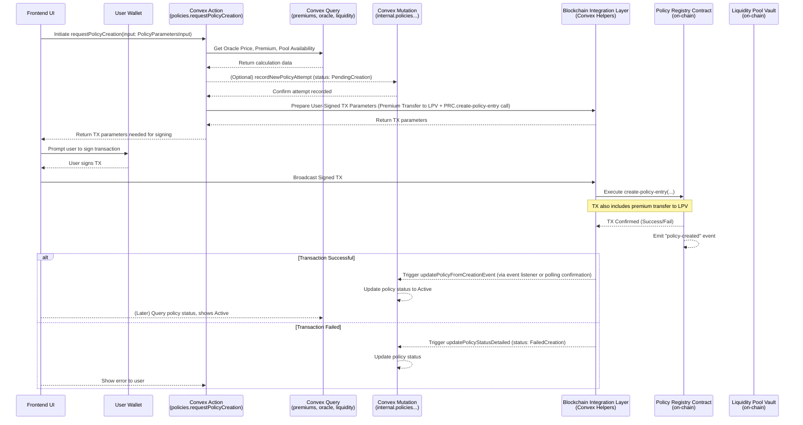
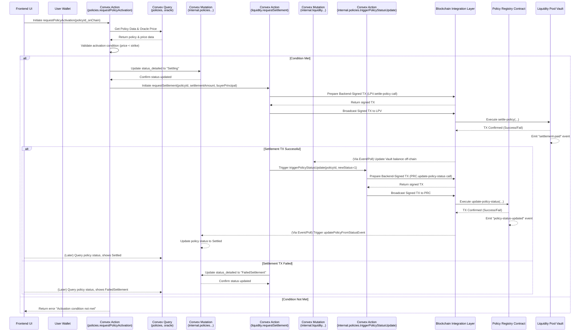
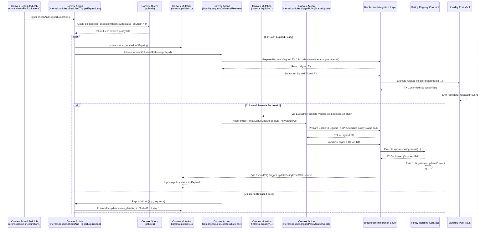

# Policy Registry Component Interaction Flows (MVP)

**Version:** 1.0
**Date:** 2024-08-21
**Status:** Draft
**Related Specs:** `bithdge-hybrid-architecture-overview.md`, `policy-registry-specification-guidelines.md`, `convex-policy-registry-architecture.md`

## 1. Introduction

This document illustrates the key interaction sequences involving the Policy Registry component in the BitHedge MVP. These flows demonstrate how user actions initiated in the frontend UI propagate through the Convex backend, Blockchain Integration Layer, and the minimal on-chain `policy-registry.clar` contract.

## 2. Flow 1: Buyer Requests Protection (Policy Creation)

This flow describes how a user (Protective Peter) purchases a protection policy.

**Key Steps:**

1.  UI triggers the Convex action with policy parameters.
2.  Convex action performs off-chain checks, calculations (premium, tier), and capacity validation.
3.  Convex action prepares the parameters for a combined on-chain transaction (premium transfer + policy entry creation).
4.  UI prompts the user to sign this transaction via their wallet.
5.  The signed transaction is broadcast.
6.  On-chain contracts execute the premium transfer (to the Vault) and create the policy entry in the Registry.
7.  Convex backend confirms the transaction and updates the off-chain policy status to `Active`.

## 3. Flow 2: Buyer Requests Activation (Policy Settlement)

This flow describes how a user activates their policy when conditions are met.

**Key Steps:**

1.  UI triggers the activation request.
2.  Convex action validates the request off-chain using current Oracle price data.
3.  If valid, Convex optimistically updates its DB status to `Settling`.
4.  Convex triggers the Liquidity Pool service action (`requestSettlement`).
5.  The Liquidity action prepares and executes a **backend-signed** transaction calling the on-chain Vault to transfer settlement funds to the buyer.
6.  Upon successful settlement transfer confirmation, the Liquidity action triggers the Policy Registry action (`triggerPolicyStatusUpdate`).
7.  The Policy Registry action prepares and executes a **backend-signed** transaction calling the on-chain Registry to update the policy status to `Settled` (`u1`).
8.  Convex backend confirms the status update and updates its off-chain policy record definitively.

## 4. Flow 3: System Triggers Expiration

This flow describes the automated process for marking policies as expired.

**Key Steps:**

1.  A scheduled Convex job runs periodically.
2.  It queries the Convex database for active policies whose `expirationHeight` has passed.
3.  For each identified policy, it initiates the collateral release process by calling the Liquidity Pool service action (`requestCollateralRelease`).
4.  The Liquidity action prepares and executes a **backend-signed** transaction calling the on-chain Vault to release the aggregate collateral associated with the policy (or batch of policies).
5.  Upon successful collateral release confirmation, the Liquidity action triggers the Policy Registry action (`triggerPolicyStatusUpdate`).
6.  The Policy Registry action prepares and executes a **backend-signed** transaction calling the on-chain Registry to update the policy status to `Expired` (`u2`).
7.  Convex backend confirms the status update and updates its off-chain policy record.

## 5. Conclusion

These flows illustrate the orchestration role of the Convex backend in managing the policy lifecycle. User-initiated actions involve user signatures for the final on-chain step, while system-initiated actions (settlement, expiration) are handled via backend-signed transactions, all interacting with the minimal on-chain contracts for finality.
