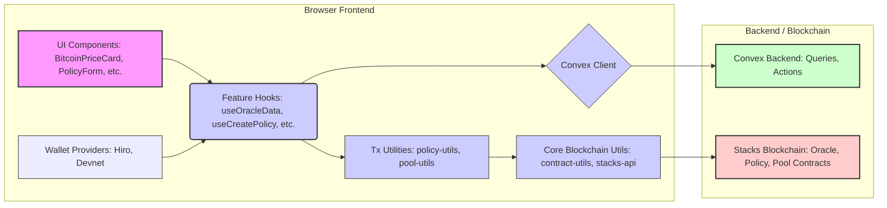

# BitHedge Oracle Specification Guidelines

**Version:** 1.0
**Date:** 2024-08-13

## 1. Introduction

This document provides the technical specification for the BitHedge Oracle system. The Oracle is a critical component responsible for providing reliable, up-to-date price information (primarily BTC/USD) to the BitHedge platform. It follows a **hybrid architecture**, leveraging both an off-chain engine (Convex) for complex computation and data processing, and an on-chain smart contract (`oracle.clar`) for trust-minimized verification and data availability to other contracts.

**Core Philosophy:**

- **Off-Chain Computation:** Fetching from multiple sources, data aggregation, statistical validation (outlier filtering), volatility calculation, range calculation, TWAP, and other complex metrics are handled by the Convex backend for efficiency, flexibility, and cost-effectiveness.
- **On-Chain Verification & Storage:** The `oracle.clar` smart contract stores the final, validated, aggregated price submitted by an authorized off-chain source. It performs minimal validation based on parameters fetched from the central `Parameter Contract` and serves as the trust anchor for other smart contracts needing the reference price.

This specification supersedes previous Oracle descriptions in general documents, reflecting the refined hybrid approach.

## 2. High-Level Architecture

```
┌───────────────────────────────────────┐      ┌─────────────────────────┐
│      External Price APIs              │      │       Frontend UI       │
│ (Binance, Coinbase, Kraken, etc.)     │      │ (`BitcoinPriceCard.tsx`)│
└───────────────────┬───────────────────┘      └────────────┬────────────┘
                    │ Fetch Raw Prices                     │ Request Data
                    ▼                                      │ (useQuery)
┌──────────────────────────────────────────────────────────┐ ▼
│                OFF-CHAIN LAYER (CONVEX)                  │
│  ┌────────────────────────────────────────────────────┐  │
│  │                 Oracle Engine                    │◄─┘
│  │  ┌───────────────┐  ┌───────────────┐  ┌─────────┤  │
│  │  │ Price Fetcher │->│  Aggregator/  │->│ Derived │  │ Serve Data
│  │  └───────────────┘  │  Validator    │  │ Metrics │  │ (Query: getLatestPriceFeedData)
│  │                     └───────────────┘  │ (Vol,   │  │
│  │                                        │ Range...)│  │
│  │                                        └─────┬────┘  │
│  │  ┌───────────────────────────────────────┐   │       │
│  │  │ Blockchain Integration / Submitter    │◄──┘       │
│  │  │ (Threshold Checks, Signing, Tx Mgmt)  │           │
│  │  └────────────────────┬──────────────────┘           │
│  │                       │ Submit Aggregated Price      │
└──────────────────────────┼────────────────────────────────┘
                           │ (via set-aggregated-price)
                           ▼
┌──────────────────────────────────────────────────────────┐
│               ON-CHAIN LAYER (CLARITY)                   │
│  ┌────────────────────┐       ┌───────────────────────┐  │
│  │   Parameter        │◄──────│ Simplified Oracle     │  │
│  │   Contract         │       │ (`oracle.clar`)       │  │
│  │   (Validation      │───────► (Stores Latest Price) │  │
│  │    Params,         │       └───────────┬───────────┘  │
│  │    Auth Submitter) │                   │              │
│  └────────────────────┘                   │ get-latest-price
│                                           ▼              │
│                                 ┌───────────────────┐  │
│                                 │ Other Contracts   │  │
│                                 │ (e.g., Policy     │  │
│                                 │  Registry)        │  │
│                                 └───────────────────┘  │
└──────────────────────────────────────────────────────────┘
```

## 3. On-Chain Component: `oracle.clar` (Simplified Oracle)

**Primary Responsibility:** Securely store the latest validated aggregated BTC/USD price submitted by the authorized off-chain Convex system, and make this price available trustlessly to other smart contracts.

### 3.1. Core State Variables

```clarity
;; Stores the latest validated BTC price (e.g., in USD with PRICE_DECIMALS)
(define-data-var latest-price uint u0)

;; Stores the Stacks block timestamp corresponding to the latest validated price
(define-data-var latest-timestamp uint u0)

;; Stores the principal authorized to submit prices (e.g., the Convex backend identity)
;; This is set by the owner and potentially read from Parameter Contract in the future.
(define-data-var authorized-submitter principal CONTRACT-OWNER)
```

### 3.2. Constants

```clarity
(define-constant CONTRACT-OWNER tx-sender) ;; Set during deployment
(define-constant ERR-UNAUTHORIZED (err u100))
(define-constant ERR-PRICE-OUT-OF-BOUNDS (err u101))
(define-constant ERR-TIMESTAMP-TOO-OLD (err u102))
(define-constant ERR-PARAMETER-CONTRACT-ERROR (err u103))
(define-constant PRICE_DECIMALS u8) ;; Example: 8 decimals for USD price
```

### 3.3. Data Maps

- None. Provider management and historical data are offloaded.

### 3.4. Public Functions

```clarity
;; @desc Sets the latest aggregated price and timestamp. Only callable by the authorized submitter.
;; Performs basic validation against parameters fetched from the Parameter Contract.
;; @param price The aggregated price (uint, with PRICE_DECIMALS)
;; @param timestamp The timestamp associated with the price (uint, Stacks block timestamp)
;; @returns (ok bool) or (err uint)
(define-public (set-aggregated-price (price uint) (timestamp uint))
  (begin
    ;; --- Authorization ---
    (asserts! (is-eq tx-sender (var-get authorized-submitter)) ERR-UNAUTHORIZED)

    ;; --- Validation ---
    (let
      (
        (current-block-time block-height)
        (last-price-val (var-get latest-price))
        ;; Fetch parameters from Parameter Contract
        (param-contract <parameter-trait>) ;; Replace with actual Parameter Contract trait call
        (max-deviation-percentage (unwrap! (contract-call? param-contract get-parameter "oracle-max-deviation-percentage") ERR-PARAMETER-CONTRACT-ERROR))
        (max-age-seconds (unwrap! (contract-call? param-contract get-parameter "oracle-max-age-seconds") ERR-PARAMETER-CONTRACT-ERROR))
        (max-age-blocks (/ max-age-seconds u10)) ;; Approximate blocks
      )
      ;; 1. Timestamp validation (must be recent relative to current block)
      (asserts! (>= timestamp (- current-block-time max-age-blocks)) ERR-TIMESTAMP-TOO-OLD)

      ;; 2. Deviation validation (compare to last stored price)
      (if (> last-price-val u0)
        (let
          (
            (price-diff (if (> price last-price-val) (- price last-price-val) (- last-price-val price)))
            (max-allowed-diff (/ (* last-price-val max-deviation-percentage) u10000))
          )
          (asserts! (<= price-diff max-allowed-diff) ERR-PRICE-OUT-OF-BOUNDS)
        )
        (ok true) ;; Skip deviation check if no previous price
      )
    )

    ;; --- State Update ---
    (var-set latest-price price)
    (var-set latest-timestamp timestamp)

    ;; --- Event Emission ---
    (print { event: "price-updated", price: price, timestamp: timestamp })

    (ok true)
  )
)

;; @desc Updates the authorized submitter principal. Only callable by the current contract owner.
;; @param new-submitter The principal of the new authorized submitter.
;; @returns (ok bool) or (err uint)
(define-public (set-authorized-submitter (new-submitter principal))
  (begin
    (asserts! (is-eq tx-sender CONTRACT-OWNER) ERR-UNAUTHORIZED)
    (var-set authorized-submitter new-submitter)
    (ok true)
  )
)
```

### 3.5. Read-Only Functions

```clarity
;; @desc Gets the latest validated price and its timestamp. Checks for staleness against Parameter Contract.
;; @returns (ok {price: uint, timestamp: uint}) or (err uint) if price is stale
(define-read-only (get-latest-price)
  (let
    (
      (price (var-get latest-price))
      (timestamp (var-get latest-timestamp))
      (current-block-time block-height)
      ;; Fetch max age from Parameter Contract
      (param-contract <parameter-trait>) ;; Replace with actual Parameter Contract trait call
      (max-age-seconds (unwrap! (contract-call? param-contract get-parameter "oracle-max-age-seconds") ERR-PARAMETER-CONTRACT-ERROR))
      (max-age-blocks (/ max-age-seconds u10)) ;; Approximate blocks
    )
    ;; Check if the stored price is too old
    (asserts! (>= timestamp (- current-block-time max-age-blocks)) ERR-TIMESTAMP-TOO-OLD)
    (ok { price: price, timestamp: timestamp })
  )
)

;; @desc Gets the currently authorized submitter principal.
;; @returns (ok principal)
(define-read-only (get-authorized-submitter)
  (ok (var-get authorized-submitter))
)
```

### 3.6. Private Functions

- None typically required for this simplified version.

### 3.7. Events

```clarity
;; Emitted via print
;; { event: "price-updated", price: uint, timestamp: uint }
```

### 3.8. Integration Points

- **Parameter Contract:** Fetches `oracle-max-deviation-percentage`, `oracle-max-age-seconds`, and potentially the `authorized-submitter` address.
- **Other Contracts (Consumers):** Call `get-latest-price` to retrieve the validated price.

### 3.9. Error Handling

- Uses defined constants (`ERR-UNAUTHORIZED`, `ERR-PRICE-OUT-OF-BOUNDS`, `ERR-TIMESTAMP-TOO-OLD`, `ERR-PARAMETER-CONTRACT-ERROR`).

## 4. Off-Chain Component: Convex Oracle Engine

**Primary Responsibility:** Fetch raw price data from multiple external sources, perform robust aggregation and validation, calculate derived metrics (volatility, range, etc.), cache results, serve data to the frontend, and conditionally submit the validated aggregated price to the `oracle.clar` contract.

### 4.1. Key Responsibilities

- **Price Fetching:** Connect to multiple external exchange APIs (REST/WebSocket).
- **Aggregation & Validation:** Implement statistical methods (e.g., weighted median, trimmed mean), outlier detection, and source reliability weighting.
- **Derived Metrics Calculation:** Calculate 24h range, historical volatility (various methods like std dev, EWMA), TWAP, price change percentages, etc., using historical data stored within Convex.
- **Data Storage & Caching:** Store historical raw and aggregated prices, calculated metrics, and oracle provider metadata within Convex database tables. Implement caching for performance.
- **Frontend Serving:** Provide query functions (e.g., `getLatestPriceFeedData`) optimized to deliver the data needed by the UI (`BitcoinPriceCard`).
- **On-Chain Submission:** Implement logic to check time/deviation thresholds and trigger updates to `oracle.clar` via the Blockchain Integration layer, using a secure backend identity for signing.

### 4.2. Key Data Structures (Conceptual - Convex DB Tables)

```typescript
// Stored within Convex database tables

interface ConvexPriceHistory {
  _id: Id<"priceHistory">;
  timestamp: number; // Unix milliseconds
  asset: string; // e.g., "BTC/USD"
  price: number; // Aggregated price with standard decimals
  sourcePrices?: { source: string; price: number }[]; // Optional raw source data
  sourceCount?: number;
  confidence?: number;
}

interface ConvexVolatility {
  _id: Id<"volatility">;
  timestamp: number; // Unix milliseconds
  asset: string;
  periodDays: 30 | 60 | 90 | 180 | 360; // Standard periods
  volatility: number; // Annualized volatility percentage
  calculationMethod: string; // e.g., "std_dev_log_returns"
}

interface ConvexOracleState {
  _id: Id<"oracleState">;
  key: "latest_btc_usd"; // Singleton pattern
  latestAggregatedPrice: number;
  latestAggregationTimestamp: number; // Unix milliseconds
  lastOnChainUpdateTimestamp?: number; // Unix milliseconds
  lastOnChainPrice?: number;
  activeSources?: string[];
}

// Other tables for provider metadata, historical ranges, TWAP results etc.
```

### 4.3. Key Functions / Modules (Conceptual - Convex `*.ts` files)

```typescript
// convex/prices.ts or similar

// Query for Frontend
export const getLatestPriceFeedData = query({
  args: { asset: v.string() },
  handler: async (ctx, args) => {
    // 1. Read latest aggregated price/timestamp from ConvexOracleState
    // 2. Query ConvexPriceHistory for last 24h to calculate rangeLow/rangeHigh
    // 3. Query ConvexVolatility for latest relevant volatility period
    // 4. Read activeSources count from ConvexOracleState
    // 5. Return structured object { price, timestamp, rangeLow, rangeHigh, volatility, activeSources }
  },
});

// Action for On-Chain Update (Triggered by Cron)
export const submitAggregatedPriceToOracle = action({
  args: { asset: v.string() },
  handler: async (ctx, args) => {
    // --- Off-Chain Aggregation & Calculation ---
    // 1. Fetch latest raw prices from external APIs
    // 2. Perform aggregation, validation, confidence scoring
    // 3. Calculate derived metrics (volatility etc.) - store in Convex DB
    // 4. Update ConvexOracleState with latest off-chain price/timestamp
    const { latestOffChainPrice, latestOffChainTimestamp } = /* ... result of aggregation ... */;

    // --- Threshold Check ---
    // 5. Call Blockchain Integration: readLatestOraclePrice() -> gets price/ts from oracle.clar
    const { lastOnChainPrice, lastOnChainTimestamp } = await ctx.runAction(api.blockchainIntegration.readLatestOraclePrice, {});
    // 6. Fetch thresholds (time, deviation) from config or Parameter Contract via integration layer
    const timeThresholdSeconds = /* ... */;
    const deviationThresholdPercent = /* ... */;
    // 7. Check if update needed:
    const timeDiff = Date.now()/1000 - (lastOnChainTimestamp || 0);
    const priceDiffPercent = lastOnChainPrice ? (Math.abs(latestOffChainPrice - lastOnChainPrice) / lastOnChainPrice) * 100 : Infinity;
    const needsUpdate = timeDiff > timeThresholdSeconds || priceDiffPercent > deviationThresholdPercent;

    // --- Submit Transaction ---
    if (needsUpdate) {
      try {
        // 8. Call Blockchain Integration: submitAggregatedPrice(price, timestamp)
        // This internal action handles secure signing with backend identity
        const txReceipt = await ctx.runAction(api.blockchainIntegration.submitAggregatedPrice, {
          price: BigInt(Math.round(latestOffChainPrice * (10**PRICE_DECIMALS))),
          timestamp: BigInt(Math.round(latestOffChainTimestamp / 1000)) // Convert ms to seconds if needed by contract
        });
        // 9. Update ConvexOracleState with on-chain submission status/timestamp
      } catch (error) {
        // Handle transaction submission error
      }
    }
  },
});

// convex/crons.ts
// Schedule submitAggregatedPriceToOracle to run periodically
```

### 4.4. Integration Points

- **External Price APIs:** Binance, Coinbase, Kraken, CoinGecko, etc.
- **Frontend (`BitcoinPriceCard.tsx`):** Serves data via `getLatestPriceFeedData` query.
- **Blockchain Integration Layer:** Module/actions within Convex responsible for secure signing and interacting with `oracle.clar`.
- **Premium Calculator (`convex/options.ts`):** Consumes price and volatility data calculated by the oracle engine.

## 5. Frontend Integration Architecture

This section details how the frontend application should interact with the Convex backend and the Stacks blockchain, considering the hybrid architecture for the Oracle and the need for direct user-signed transactions for other contracts (e.g., Policy Registry, Liquidity Pool).

### 5.1. Oracle Data Interaction (`BitcoinPriceCard.tsx`)

- **Primary Data Flow:** The `BitcoinPriceCard` component **must** fetch its data (current price, 24h range, volatility, source count, last update time) **directly from Convex**.
  - **Mechanism:** Utilize Convex's React hooks (`useQuery`) to call a dedicated Convex query function (e.g., `api.prices.getLatestPriceFeedData` as specified in Section 4.3).
  - **Rationale:** This provides the most up-to-date off-chain information with the lowest latency, leveraging Convex's computation and caching capabilities.
- **No Direct Oracle Transactions:** The UI **does not** initiate transactions to update the `oracle.clar` contract. This is handled exclusively by the Convex backend (Section 4.3).
- **Optional On-Chain Read (Hackathon Compromise):** To visually demonstrate on-chain interaction, `BitcoinPriceCard` _could_ make a secondary, less frequent read-only call directly to `oracle.clar`'s `get-latest-price` function. This would require using the `@stacks/blockchain-api-client` (configured via `stacks-api.ts`) and associated helpers. The result ("Last Confirmed On-Chain Price") should be displayed _alongside_ the primary data fetched from Convex to highlight the difference between off-chain and on-chain state.

### 5.2. Other Contract Interactions (Policy, Pool, etc.)

- **User-Signed Transactions:** Actions like creating a policy, depositing collateral, or withdrawing funds **must** be initiated by the user and require a **user signature** via their connected wallet (Hiro or Devnet equivalent).
- **Mechanism:**
  1.  **UI Components:** (e.g., `PolicyCreationForm`, `PoolDepositModal`) gather user input.
  2.  **Transaction Utilities:** New utility files (e.g., `front-end/src/lib/policy-utils.ts`, `front-end/src/lib/pool-utils.ts`) are created. These contain functions that accept user input and generate the appropriate `ContractCallRegularOptions` object needed to call the target contract function (e.g., `policy-registry.create-policy`, `liquidity-pool.deposit`).
  3.  **Transaction Execution Hook:** A hook like `useTransactionExecuter` (from the fundraising example) is called with the generated `txOptions`.
  4.  **Core Blockchain Utils:** The `useTransactionExecuter` hook utilizes `contract-utils.ts` functions (`openContractCall` for Testnet/Mainnet, `executeContractCall` for Devnet) to handle the interaction with the user's wallet (prompting for signature) or direct signing (Devnet) and broadcasting the transaction.
  5.  **UI Feedback:** The hook manages loading states and provides success/error feedback (e.g., via toasts).
- **Read-Only Calls:** Components needing data directly from contracts like the Policy Registry or Liquidity Pool (e.g., fetching a user's specific policies or deposits) can use read-only calls.
  - **Mechanism:** Use custom hooks (e.g., `useUserPolicies`, `usePoolDeposit`) built with `@tanstack/react-query`. These hooks utilize the `stacks-api.ts` helper to configure the API client and call the relevant `smartContractsApi.callReadOnlyFunction`. Clarity Value conversions (`cvToHex`, `hexToCV`, `cvToJSON`) are handled within these hooks.

### 5.3. Reusable Frontend Architecture Components

Based on the `fundraising` starter template analysis, the following components and patterns should be reused and adapted:

- **Wallet Management:** `HiroWalletProvider`, `DevnetWalletProvider`, `devnet-wallet-context` are essential and directly reusable.
- **State Management:** The pattern of using `@tanstack/react-query` for server state (blockchain or Convex data) combined with React Context for global UI state (like wallet connection) is highly recommended.
- **Core Blockchain Utils:** `contract-utils.ts` (for signing/broadcasting user transactions) and `stacks-api.ts` (for configuring the API client for read-only calls) are fundamental and reusable.
- **Transaction Execution Hook:** The pattern implemented in `useTransactionExecuter` is reusable for handling the lifecycle (initiation, signing, broadcasting, feedback) of any user-signed transaction.
- **Configuration:** The pattern in `contracts.ts` should be reused and expanded to include identifiers for all BitHedge contracts (`oracle`, `parameter`, `policy-registry`, `liquidity-pool`, etc.).
- **General Utilities:** `currency-utils.ts`, `clarity-utils.ts` are likely reusable.

### 5.4. Recommended Frontend Structure

- **Hooks:** Organize hooks by feature/contract:
  - `hooks/oracleQueries.ts`: Fetching data _from Convex_ Oracle Engine.
  - `hooks/policyQueries.ts`: Fetching policy data (likely direct reads via `stacks-api`).
  - `hooks/policyMutations.ts`: Initiating user-signed policy transactions (using `contract-utils`).
  - `hooks/poolQueries.ts` / `hooks/poolMutations.ts`: Similar structure for Liquidity Pool.
  - `hooks/chainQueries.ts`: General blockchain info.
  - `hooks/useTransactionExecuter.ts`: Reusable transaction helper.
- **Lib Utilities:**
  - Keep core `contract-utils.ts`, `stacks-api.ts`, `currency-utils.ts` etc.
  - Create new `policy-utils.ts`, `pool-utils.ts` etc. to encapsulate the construction of `ContractCallRegularOptions` for specific contract calls.
- **Constants:** Update `contracts.ts` with all relevant contract details.
- **Components:** Build feature-specific components (e.g., `PolicyList`, `DepositForm`) that utilize the corresponding hooks.

**Conceptual Frontend Architecture Diagram:**



**ASCII Version:**

```ascii
+--------------------------------------------------------------------+
|                         Browser Frontend                         |
+--------------------------------------------------------------------+
| +------------------------+        +------------------------------+ |
| | Wallet Providers       |------->| Feature Hooks                | |
| | (Hiro, Devnet)         |        | (useOracleData, useCreate...)├-+
| +------------------------+        | (useOracleData, useCreate...)├-+
|                                                  |                 | |
|                                                  |                 | |
|  +------------------------+ <--------------------+                 | |
|  | UI Components          |                      |                 | |
|  | (BitcoinPriceCard, ...)◄----------------------┘                 | |
|  +------------------------+                                        | |
|                                                  |                 | |
|                                                  |                 | |
|          +-----------------------+ <-------------+                 | |
|          | Convex Client         |                                 | |
|          +----------+------------+                                 | |
|                     |                                              | |
|                     |                                              | |
|                     v                                              | |
| +--------------------------------+        +----------------------+ |
| | Tx Utilities                   |------->| Core Blockchain Utils| |
| | (policy-utils, pool-utils)   |        | (contract-utils, ...)├-+
| +--------------------------------+        +----------+-----------+ |
+------------------------------------------------------|-------------+
                                                       |
                                                       v
+------------------------------------------------------|-------------+
|                    Backend / Blockchain              |             |
+------------------------------------------------------|-------------+
| +-----------------------+         +------------------|-----------+ |
| | Convex Backend        |         | Stacks Blockchain              | |
| | (Queries, Actions)    |         | (Oracle, Policy, Pool Contracts)| |
| +---------▲-------------+         +------------------▲-----------+ |
|           |                                          |             | |
|           +------------------------------------------+             | |
+--------------------------------------------------------------------+
```

This architecture provides a clear separation for interacting with Convex (for oracle data) and directly with the blockchain (for user-signed actions and specific reads), leveraging the reusable patterns from the starter template.

## 6. Security Considerations

- **Off-Chain Security:**
  - Secure storage of API keys for external price sources.
  - Robust validation and outlier detection in aggregation to prevent manipulation from faulty sources.
  - Secure management of the **backend Stacks identity private key** used for signing on-chain updates (use Convex environment variables/secrets management).
  - Rate limiting and error handling for external API calls.
- **On-Chain Security:**
  - Strict authorization check in `set-aggregated-price` (only `authorized-submitter`).
  - Fetching validation parameters (`max-deviation`, `max-age`) from the trusted `Parameter Contract`.
  - Simplicity of the contract minimizes attack surface.
- **Overall:**
  - Monitoring of price deviations between off-chain and on-chain data.
  - Monitoring health and responsiveness of external price sources.
  - Circuit breakers (potentially managed via Parameter Contract) if the oracle system becomes unreliable.

## 7. Implementation Guidance & Priorities

1.  **Refactor `oracle.clar`:** Implement the simplified version specified in Section 3, removing complex calculations and history.
2.  **Parameter Contract Integration:** Define the trait/interface and integrate `oracle.clar` to fetch parameters.
3.  **Convex Oracle Engine:**
    - Implement robust off-chain aggregation and validation.
    - Implement off-chain volatility and range calculations.
    - Implement `getLatestPriceFeedData` query for the UI.
4.  **Blockchain Integration Layer:** Develop the Convex actions/utils to securely sign and submit transactions to the simplified `oracle.clar` (`set-aggregated-price`) and read from it (`get-latest-price`).
5.  **Convex Cron Job:** Schedule the `submitAggregatedPriceToOracle` action with appropriate threshold logic.
6.  **Frontend Integration:** Connect `BitcoinPriceCard.tsx` using `useQuery` to fetch data from `getLatestPriceFeedData`.

## 8. Conclusion

This specification outlines a robust and efficient hybrid oracle system for BitHedge. By clearly separating responsibilities – complex computation and data handling in Convex, trust-minimized storage and verification in `oracle.clar` – the system achieves performance, flexibility, cost-efficiency, and security. Adhering to this specification will provide a solid foundation for the BitHedge platform's price data needs.
