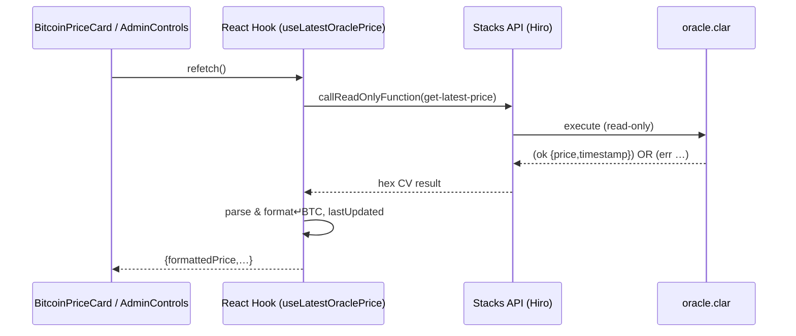
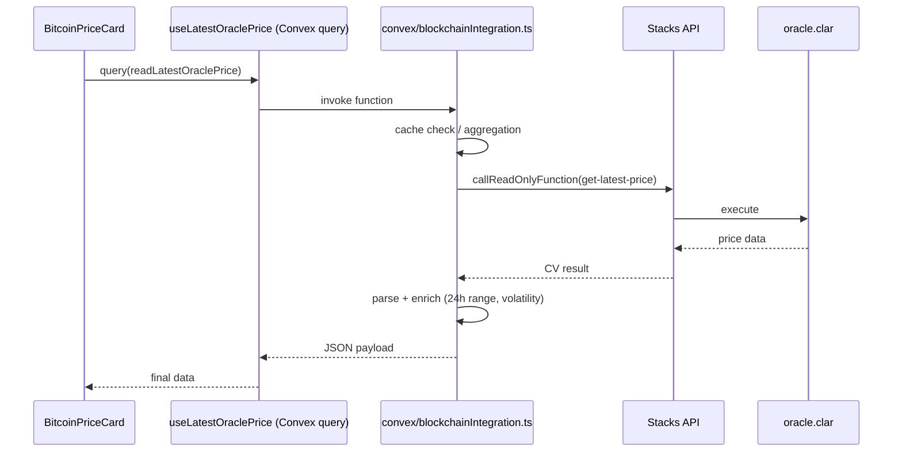

BitHedge Architecture Diagram
┌───────────────────────────────────────────────────────────────────────────┐
│ UI LAYER │
│ │
│ ┌─────────────────────────┐ ┌───────────────────────────┐ │
│ │ BitcoinPriceCard.tsx │ │ OracleAdminControls.tsx │ │
│ │ │ │ │ │
│ │ - Displays BTC price │ │ - Updates price data │ │
│ │ - Shows volatility │ │ - For authorized users │ │
│ │ - Handles refresh │ │ - Signs transactions │ │
│ └─────────┬───────────────┘ └─────────────┬─────────────┘ │
│ │ │ │
└────────────┼───────────────────────────────────────┼──────────────────────┘
│ │  
 ▼ ▼  
┌───────────────────────────────────────────────────────────────────────────┐
│ HOOKS LAYER │
│ │
│ ┌─────────────────────────┐ ┌───────────────────────────┐ │
│ │ useLatestOraclePrice │ │ useIsAuthorizedSubmitter │ │
│ │ │ │ │ │
│ │ - Fetches price data │ │ - Checks if wallet can │ │
│ │ - Handles formatting │ │ update oracle data │ │
│ └─────────┬───────────────┘ └─────────────┬─────────────┘ │
│ │ │ │
└────────────┼───────────────────────────────────────┼──────────────────────┘
│ │  
 │ │  
 │ Current Direct API Path │  
 │ ┌───────────────────────┐ │  
 └────► Stacks Blockchain ├──────────┘  
 │ API Client │  
 └─────────┬─────────────┘  
 │  
 ▼  
┌───────────────────────────────────────────────────────────────────────────┐
│ BLOCKCHAIN LAYER │
│ │
│ ┌─────────────────────────┐ ┌───────────────────────────┐ │
│ │ Stacks API Endpoint │ │ oracle.clar Contract │ │
│ │ │ │ │ │
│ │ - Handles API calls │ │ - Stores price data │ │
│ │ - Returns CV values │ │ - Manages authorization │ │
│ └─────────────────────────┘ └───────────────────────────┘ │
│ │
└───────────────────────────────────────────────────────────────────────────┘

                     Future Planned Architecture

┌───────────────────────────────────────────────────────────────────────────┐
│ UI LAYER │
│ │
│ ┌─────────────────────────┐ ┌───────────────────────────┐ │
│ │ BitcoinPriceCard.tsx │ │ OracleAdminControls.tsx │ │
│ └─────────┬───────────────┘ └─────────────┬─────────────┘ │
│ │ │ │
└────────────┼───────────────────────────────────────┼──────────────────────┘
│ │  
 ▼ ▼  
┌───────────────────────────────────────────────────────────────────────────┐
│ HOOKS LAYER │
│ │
│ ┌─────────────────────────┐ ┌───────────────────────────┐ │
│ │ useLatestOraclePrice │ │ useIsAuthorizedSubmitter │ │
│ │ (calls Convex) │ │ (calls Convex) │ │
│ └─────────┬───────────────┘ └─────────────┬─────────────┘ │
│ │ │ │
└────────────┼───────────────────────────────────────┼──────────────────────┘
│ │  
 ▼ ▼  
┌───────────────────────────────────────────────────────────────────────────┐
│ CONVEX LAYER │
│ │
│ ┌─────────────────────────┐ ┌───────────────────────────┐ │
│ │ readLatestOraclePrice │ │ checkIsAuthorized │ │
│ │ │ │ │ │
│ │ - Communicates with │ │ - Verifies permissions │ │
│ │ blockchain │ │ - Handles auth logic │ │
│ │ - Does data validation │ │ │ │
│ │ - Caches results │ │ │ │
│ └─────────┬───────────────┘ └─────────────┬─────────────┘ │
│ │ │ │
└────────────┼───────────────────────────────────────┼──────────────────────┘
│ │  
 ▼ ▼  
┌───────────────────────────────────────────────────────────────────────────┐
│ INTEGRATION LAYER │
│ │
│ ┌─────────────────────────────────────────────────────────────┐ │
│ │ blockchainIntegration.ts │ │
│ │ │ │
│ │ - Manages blockchain connections │ │
│ │ - Handles network selection (mainnet/testnet/devnet) │ │
│ │ - Error handling & retry logic │ │
│ └─────────┬─────────────────────────────────────┬─────────────┘ │
│ │ │ │
└────────────┼─────────────────────────────────────┼────────────────────────┘
│ │  
 ▼ ▼  
┌───────────────────────────────────────────────────────────────────────────┐
│ BLOCKCHAIN LAYER │
│ │
│ ┌─────────────────────────┐ ┌───────────────────────────┐ │
│ │ Stacks API Endpoint │ │ oracle.clar Contract │ │
│ └─────────────────────────┘ └───────────────────────────┘ │
│ │
└───────────────────────────────────────────────────────────────────────────┘

Detailed Component Interaction Flow in BitHedge Oracle System
Current Implementation (Direct API Calls)
Price Data Reading Flow
User Interaction Starts Flow:
User visits the application or clicks the "Refresh" button in BitcoinPriceCard.tsx
BitcoinPriceCard.tsx calls handleRefresh() function which invokes refetch() from the useLatestOraclePrice hook
Hook Initiates Blockchain Query:
useLatestOraclePrice hook in oracleQueries.ts executes its query function
Hook creates a Stacks API client instance via getApi(getStacksUrl()).smartContractsApi
TanStack Query's cache is checked first - if data is recent enough, cached data is used
Blockchain API Communication:
If cache is stale or empty, hook calls api.callReadOnlyFunction() with:
Contract address and name (ORACLE_CONTRACT.address, ORACLE_CONTRACT.name)
Function name ("get-latest-price")
Empty arguments array (this function takes no parameters)
Sender address (uses the contract's own address)
Blockchain Contract Execution:
Stacks API processes the read-only function call request
Request reaches the Stacks node running the blockchain
Stacks node executes the get-latest-price function in the oracle.clar contract
Contract checks if price data exists and returns either:
(ok {price: u<number>, timestamp: u<number>}) with price data
(err u104) if no price data exists (ERR-NO-PRICE-DATA)
(err u102) if price data is too old (ERR-TIMESTAMP-TOO-OLD)
Response Processing:
API response returns to the hook with response.result containing a hex-encoded Clarity Value
Hook parses the result with cvToJSON(hexToCV(response?.result)) to convert to a JavaScript object
Hook checks if result is successful (result?.success)
If successful, hook extracts price and timestamp from the result structure
Data Formatting and UI Updates:
Hook converts price from satoshis to BTC (Number(price) / 100000000)
Hook formats the timestamp into a human-readable relative time string ("2 minutes ago")
Result object is constructed with price, timestamp, formattedPrice, and lastUpdatedTime
TanStack Query updates its cache with the new data
React re-renders BitcoinPriceCard.tsx with the new data in the oracleData variable
UI Display:
BitcoinPriceCard.tsx accesses oracleData.formattedPrice to display the current price
Component accesses oracleData.lastUpdatedTime to show when the price was last updated
Loading states are handled based on the isLoading value from the hook
Error states are handled based on the isError and error values from the hook
Price Data Update Flow (Authorized Submitters Only)
User Interaction Starts Flow:
User enters new price in OracleAdminControls.tsx and clicks "Submit Price Update"
Component calls handleUpdatePrice() function
Authorization Check:
OracleAdminControls.tsx is only rendered if isAuthorizedSubmitter is true
This value comes from the useIsAuthorizedSubmitter hook that checked the user's wallet address
Hook previously queried get-authorized-submitter on the contract and compared with wallet address
Transaction Preparation:
handleUpdatePrice() converts price from USD to satoshis (Math.round(parseFloat(price) \* 100000000))
Function gets current timestamp (Math.floor(Date.now() / 1000))
Function calls getSetAggregatedPriceTx() from oracle-utils.ts to create transaction options
Transaction options include function name, arguments, network, and post conditions
Transaction Execution:
Function calls executeTx() from useTransactionExecuter hook
Based on network, transaction is handled differently:
Devnet: Uses executeContractCall() which directly signs the transaction with devnet wallet
Testnet/Mainnet: Uses openContractCall() which prompts user with browser wallet extension
Wallet Signing:
For Devnet: Transaction is signed with the private key from devnetWallet.mnemonic
For Testnet/Mainnet: User approves transaction in their Hiro Wallet browser extension
Signed transaction is broadcast to the Stacks network
Blockchain Contract Execution:
Stacks node receives and validates the transaction
If valid, node executes the set-aggregated-price function in oracle.clar
Contract validates the caller is authorized (tx-sender matches authorized-submitter)
Contract validates price deviation is within allowed range
Contract validates timestamp is recent enough
Contract updates the stored price and timestamp
Response and UI Updates:
Transaction result is returned to the application
On success, function calls onPriceUpdate() which triggers refetch() in BitcoinPriceCard
BitcoinPriceCard gets fresh data via useLatestOraclePrice hook
UI is updated with the new price data
Future Implementation (With Convex)
Price Data Reading Flow
User Interaction Starts Flow:
User visits the application or clicks "Refresh" button in BitcoinPriceCard.tsx
Component calls handleRefresh() which triggers state change in Convex
Hook Connects to Convex Backend:
useLatestOraclePrice hook uses useConvexQuery(api.blockchainIntegration.readLatestOraclePrice)
Convex automatically manages query caching and updating
Convex Backend Processing:
readLatestOraclePrice in convex/blockchainIntegration.ts executes
Function checks Convex database for cached recent result
If no recent cache, function prepares to call blockchain
Blockchain API Communication:
Convex function uses callReadOnlyFunction() from @stacks/transactions
Function provides contract details, function name, and network information
Request is authenticated using backend credentials (not user credentials)
Blockchain Contract Execution:
Same as in current implementation - Stacks node executes contract function
Contract returns either price data or error code
Convex Data Processing:
Convex function receives and parses the response
Function performs more sophisticated error handling and logging
Function formats and processes the data
Convex stores processed result in its database for future caching
Frontend Data Retrieval:
Convex sends the formatted result back to the frontend
React hook receives the data via useConvexQuery
BitcoinPriceCard.tsx renders with the new data
Convex automatically handles reactivity - when data changes, UI updates
Real-time Updates:
If the price changes in the Convex database (from other users or backend processes)
Convex push mechanism automatically updates the UI without manual refresh
This provides real-time synchronization across all users
Price Data Update Flow (Authorized Submitters Only)
User Interaction Starts Flow:
User enters price in OracleAdminControls.tsx and clicks "Submit Price Update"
Component calls handleUpdatePrice()
Convex Mutation Called:
Function calls a Convex mutation instead of direct transaction
For example: useMutation(api.blockchainIntegration.submitPriceUpdate)
Price data and user context are sent to Convex backend
Backend Authorization & Validation:
Convex function validates input data (price format, reasonable range, etc.)
Convex checks if the user is authorized by querying the contract
Convex may perform additional validation (comparing with external sources)
Transaction Creation & Signing:
Convex backend creates the transaction with proper parameters
For fully serverless operations, backend has a wallet which signs transactions
For user-signed operations, Convex returns parameters and frontend prompts user
Blockchain Update:
Transaction is submitted to the blockchain
Contract performs its validation and updates the price
Confirmation & Data Propagation:
Convex confirms transaction was successful by tracking it
When confirmed, Convex updates its own database with new price
Updated price is automatically propagated to all connected clients
UI Updates:
All instances of BitcoinPriceCard.tsx across all users automatically update
No manual refresh required - Convex reactivity handles updates
This detailed flow illustrates how the different components interact in both the current direct API implementation and the future Convex-based architecture. The Convex approach adds centralized validation, caching, real-time updates, and better security practices, while reducing the blockchain interaction code in the frontend.

The key is understanding that the oracle.clar contract on the blockchain starts empty. It doesn't magically know the Bitcoin price when deployed. Data has to be put into it.
The only way to get price data into the oracle.clar contract is by calling the set-aggregated-price function. This function can only be called by the authorized-submitter.
So, how does that first price get submitted? Here are the likely scenarios based on your architecture:
Planned Automated Flow (Convex -> Blockchain):
The Convex backend is designed to fetch prices from multiple external APIs (like CoinGecko, Binance, Kraken, etc. - tasks CVX-201, CVX-202).
It aggregates these prices to determine a reliable current price.
A scheduled job or trigger within Convex (task CVX-209, CVX-301, CVX-302) will determine it's time to update the on-chain price (e.g., first run, or price deviation threshold met).
Crucially: The Convex backend itself (or a wallet controlled by the backend) needs to be set as the authorized-submitter on the oracle.clar contract.
The Convex backend then directly calls the set-aggregated-price function on the oracle.clar contract, submitting the first aggregated price.
In this flow: External APIs -> Convex -> Blockchain. The UI is only reading the data after it's on the blockchain (or potentially reading a pre-chain value from Convex).
Manual Initialization Flow (Admin -> UI -> Blockchain):
An administrator (who controls the wallet set as the initial authorized-submitter, possibly the contract deployer initially) needs to "seed" the oracle.
They would use the OracleAdminControls.tsx component we created.
They manually enter the current Bitcoin price.
Clicking "Submit Price Update" triggers the handleUpdatePrice function.
This function uses the useTransactionExecuter hook, which prepares and signs the set-aggregated-price transaction using the admin's connected wallet.
The transaction is sent to the blockchain, putting the first price into the oracle.clar contract.
In this flow: Admin Input -> UI (OracleAdminControls) -> Blockchain.
Which one happens first?
Typically, the Manual Initialization (Admin) might happen first immediately after deployment to get some price data on-chain quickly.
However, the Automated Flow (Convex) is the intended operational mechanism. Once Convex is running and configured as the authorized submitter, it should take over submitting prices regularly, including the "first" price it calculates after initialization.
Answering your specific options:
Convex -> Blockchain? Yes. This is the primary intended operational flow. Convex calculates the price and submits it.
Convex -> UI -> Blockchain? No. The UI reads data; it doesn't typically act as an intermediary for automated price submissions from Convex to the Blockchain. Convex submits directly.
Admin? Yes. An admin can manually initialize the price, likely via the UI (OracleAdminControls) which then interacts with the blockchain.
Therefore, the initial data feed comes either directly from Convex (acting as the authorized submitter) to the blockchain based on external API data OR manually from an Admin (via the UI or another tool) to the blockchain.

Okay, let's break down how the UI (BitcoinPriceCard.tsx) gets populated in both the current and planned future architectures, once the oracle.clar contract has data.

1. Current Implementation (Direct API Calls)
   UI Source: Directly from the Blockchain (via Stacks API)
   Flow:
   BitcoinPriceCard.tsx uses the useLatestOraclePrice hook.
   useLatestOraclePrice (in oracleQueries.ts) calls the Stacks Blockchain API (getApi(getStacksUrl()).smartContractsApi.callReadOnlyFunction).
   This API call executes the get-latest-price function on the deployed oracle.clar contract.
   The blockchain returns the price and timestamp stored in the contract.
   The hook receives this data, formats it (calculates formattedPrice, lastUpdatedTime), and provides it to BitcoinPriceCard.tsx.
   Convex Role: In this setup, Convex is not involved in reading the price data for the UI. It's bypassed entirely for this specific data fetch.
2. Future/Planned Implementation (Using Convex)
   UI Source: From the Convex Backend
   Flow:
   BitcoinPriceCard.tsx uses the useLatestOraclePrice hook.
   useLatestOraclePrice (in oracleQueries.ts) will be modified to use the Convex useQuery hook, calling a function like api.blockchainIntegration.readLatestOraclePrice.
   The Convex backend function (readLatestOraclePrice in convex/blockchainIntegration.ts) executes.
   Inside Convex: This function calls the Stacks blockchain (using callReadOnlyFunction) to execute get-latest-price on the oracle.clar contract.
   Inside Convex: The backend receives the raw price/timestamp from the blockchain.
   Inside Convex: It might perform additional logic:
   Parse and format the data.
   Potentially fetch/calculate off-chain data (like 24h range, volatility, % change – which are not stored in your simplified oracle.clar contract) using data stored within Convex itself.
   Cache the result within Convex.
   Convex returns the combined/formatted data (containing both the on-chain price/timestamp and potentially the off-chain calculated metrics) to the frontend hook (useLatestOraclePrice).
   The hook provides this complete dataset to BitcoinPriceCard.tsx.
   Convex Role: In this setup, Convex acts as an intermediary and data augmentation layer. The UI only talks to Convex to get its data. Convex is responsible for fetching the on-chain portion from the blockchain and potentially adding other relevant off-chain metrics.
   Summary:
   Currently: UI reads directly from Blockchain.
   Future: UI reads from Convex. Convex, in turn, reads the core price from the Blockchain and may add extra calculated data before sending it to the UI.
   So, to answer "both?", in the future state, the UI's data originates from both (on-chain price from Blockchain, calculated stats from Convex), but the UI's direct data source is only Convex.

BitHedge Oracle – Component & Data-Flow Technical Summary

\_Last updated: {{DATE}}

---

## 1. Purpose

This document explains **how data flows** through the BitHedge Oracle system **today** (direct-to-blockchain) and **how it will work** when the Convex backend is fully integrated. It is intended for engineers onboarding to the project and for reviewers who need to understand where each component sits in the stack.

---

## 2. Actors & Components

| Layer                | Component                         | Responsibility                                                       |
| -------------------- | --------------------------------- | -------------------------------------------------------------------- |
| **UI**               | `BitcoinPriceCard.tsx`            | Display price feed, volatility, 24 h range, refresh button           |
|                      | `OracleAdminControls.tsx`         | Allows authorised wallet to push a price update                      |
| **Hooks**            | `useLatestOraclePrice`            | Fetch price data for UI                                              |
|                      | `useIsAuthorizedSubmitter`        | Verify wallet's on-chain role                                        |
| **Utils**            | `oracle-utils.ts`                 | Build `set-aggregated-price` & `set-authorized-submitter` tx options |
| **Tx Exec**          | `useTransactionExecuter`          | Signs & broadcasts contract transactions                             |
| **Backend (Convex)** | `convex/blockchainIntegration.ts` | (Future) read & submit price; aggregation, caching                   |
| **Blockchain API**   | Hiro / local node REST endpoint   | Executes read-only calls & receives broadcasts                       |
| **Smart-Contract**   | `oracle.clar`                     | Stores latest price + timestamp; enforces auth, bounds checks        |

---

## 3. Current Flow (Direct API)

_When Admin pushes an update:_

1. `OracleAdminControls` builds tx via `oracle-utils.ts` and `useTransactionExecuter`.
2. Wallet signs → API → `oracle.clar` executes `set-aggregated-price` → state updated.

The UI then re-fetches and displays the new value.

---

## 4. Future Flow (Convex-Centric)

Key points:

- **Single Source**: UI always calls Convex; Convex calls blockchain as needed.
- **Real-time pushes:** Convex automatically invalidates queries → UI updates without manual refresh.
- **Aggregation logic**: CVX-201/202 will compute weighted median, outlier filtering inside Convex **before** on-chain submission.

---

## 5. Who Feeds the Oracle First?

### Manual seeding (today)

- Deployer wallet = initial `authorized-submitter`.
- Admin opens **OracleAdminControls** → signs `set-aggregated-price` → first on-chain value.

### Automated feed (future)

- Convex backend wallet is set as `authorized-submitter`.
- Scheduled job (CVX-209) fetches external APIs → aggregates → submits `set-aggregated-price`.

---

## 6. Error & Edge-Case Handling

| Scenario               | Contract code               | Frontend behaviour                                                  |
| ---------------------- | --------------------------- | ------------------------------------------------------------------- |
| No price yet           | `(err u104)`                | Hook throws "No price data available yet" → UI shows warning banner |
| Data too old           | `(err u102)`                | Hook throws "Price data is too old" → UI may show stale indicator   |
| Large deviation update | `(err u103)` (price bounds) | Admin dialog shows toast "price out of bounds"                      |

---

## 7. Migration Steps to Convex

1. Ensure Convex project generates `_generated/api` export.
2. Finish `readLatestOraclePrice` query with caching & enrichment.
3. Switch `oracleQueries.ts` to Convex call (remove Stacks direct call).
4. Implement `submitAggregatedPrice` mutation + cron.
5. Update `useIsAuthorizedSubmitter` to Convex query for consistency.

---

## 8. Glossary

- **CV** – Clarity Value (binary representation of contract data).
- **Authorized-Submitter** – Address allowed to call `set-aggregated-price`.
- **Hiro API** – REST interface to a Stacks node.

---

© 2024 BitHedge – Engineering
