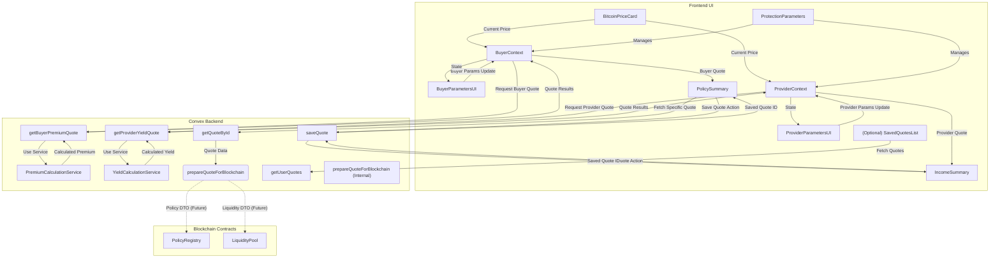

# Premium Parameters Development Plan

**Version:** 1.1  
**Date:** 2024-08-20  
**Context:** Implementing premium calculation and policy quote functionality across UI, Convex, and blockchain integration for `ProtectionParameters.tsx`, `BuyerParametersUI.tsx`, and `ProviderParametersUI.tsx`. (Incorporates architectural review feedback).

## 1. Project Overview

This plan outlines the tasks required to implement the complete premium calculation and policy quote system for BitHedge, connecting the parameter UI components to the Convex backend and preparing for eventual blockchain integration. The implementation will accommodate both user personas (Protection Buyer and Liquidity Provider) as selected by the `PremiumCalculatorTabs.tsx` component.

### Project Goals

1.  Connect parameter inputs from UI components to Convex backend for real-time premium/yield calculations and quotes.
2.  Implement dynamic data synchronization between components (e.g., BTC price from `BitcoinPriceCard.tsx`).
3.  Create a comprehensive premium calculation service in Convex based on Black-Scholes model and provider yield models.
4.  Develop the quote generation system for both buyer and provider personas, including persistence.
5.  Prepare clear interfaces and data structures for eventual blockchain integration with Policy Registry and Liquidity Pool contracts.
6.  Ensure a responsive UI with client-side estimation and robust error handling.

## 2. Task Status Legend

| Status      | Symbol | Description                                   |
| ----------- | ------ | --------------------------------------------- |
| Not Started | ⬜     | Task has not been started yet                 |
| In Progress | 🟡     | Task is actively being worked on              |
| Blocked     | 🔴     | Task is blocked by unresolved dependencies    |
| Testing     | 🟣     | Implementation complete, currently in testing |
| Completed   | 🟢     | Task fully completed and verified             |
| Deferred    | ⚪     | Task postponed to a future development cycle  |

## 3. Development Phases

### Phase 1: Data Context, Utilities, and Component Integration (Duration: Est. 4 days)

**Goal:** Establish domain-specific contexts, essential utilities, and initial data flow between components.

| Task ID      | Description                                                                                               | Est. Hours | Status | Dependencies   | Assignee | Notes                                                    |
| :----------- | :-------------------------------------------------------------------------------------------------------- | :--------- | :----- | :------------- | :------- | :------------------------------------------------------- |
| **UI-101**   | Design and implement domain-specific contexts (`BuyerContext`, `ProviderContext`)                         | 6          | ⬜     |                |          | Replaces single `PremiumDataContext`.                    |
| **UI-102**   | Update `ProtectionParameters` to manage context switching based on `currentUserRole`                      | 3          | ⬜     | UI-101         |          |                                                          |
| **UI-103**   | Update `BuyerParametersUI` to consume `BuyerContext`                                                      | 5          | ⬜     | UI-101         |          | Migrate parameter state management.                      |
| **UI-104**   | Update `ProviderParametersUI` to consume `ProviderContext` (already mostly done via props, review needed) | 3          | ⬜     | UI-101         |          | Review prop drilling vs direct context usage.            |
| **UI-105**   | Create `useBitcoinPrice` hook with robust loading/error handling & caching strategy note                  | 4          | ⬜     |                |          | Ensure consistent price source.                          |
| **UI-106**   | Implement dynamic USD value calculation in relevant UI components using `useBitcoinPrice`                 | 3          | ⬜     | UI-103, UI-105 |          | E.g., in `BuyerParametersUI`.                            |
| **UI-107**   | Implement validation logic for parameter inputs (can leverage `zod` or similar)                           | 4          | ⬜     | UI-103, UI-104 |          | Separate validation schemas for buyer/provider.          |
| **UI-108**   | Create reusable `ValidationError` display component                                                       | 2          | ⬜     | UI-107         |          | Integrate with input validation.                         |
| **UI-109**   | Create utility functions for formatting monetary values consistently                                      | 2          | ⬜     |                |          |                                                          |
| **TEST-101** | Create unit tests for validation schemas and formatting utilities                                         | 4          | ⬜     | UI-107, UI-109 |          | Focus on edge cases and different locales if applicable. |
| **TEST-102** | Basic component tests verifying context consumption and updates                                           | 4          | ⬜     | UI-103, UI-104 |          | Use testing-library and mock providers.                  |

**Phase 1 Deliverables:**

- Domain-specific React contexts for Buyer and Provider parameters.
- UI components integrated with their respective contexts.
- Robust `useBitcoinPrice` hook for synchronized price data.
- Parameter validation logic and reusable error display component.
- Formatting utilities with unit tests.

### Phase 2: Convex Premium Calculation Backend (Duration: Est. 5 days)

**Goal:** Implement the Convex backend services for premium/yield calculation, defining clear domain services.

| Task ID      | Description                                                                                | Est. Hours | Status | Dependencies     | Assignee | Notes                                                           |
| :----------- | :----------------------------------------------------------------------------------------- | :--------- | :----- | :--------------- | :------- | :-------------------------------------------------------------- |
| **CVX-201**  | Define Convex schema: `premiumCalculations`, `yieldCalculations`, `riskParameters`         | 4          | ⬜     |                  |          | As per `convex-schema-design.md`.                               |
| **CVX-202**  | Define `PremiumCalculationService` (Conceptual TS interface/class structure)               | 2          | ⬜     |                  |          | Encapsulate calculation logic.                                  |
| **CVX-203**  | Implement Black-Scholes model within `PremiumCalculationService`                           | 8          | ⬜     | CVX-202          |          |                                                                 |
| **CVX-204**  | Implement provider yield calculation model within a dedicated service/module               | 6          | ⬜     |                  |          |                                                                 |
| **CVX-205**  | Create `calculateBuyerPremium` **internal query** used by the service                      | 4          | ⬜     | CVX-203          |          |                                                                 |
| **CVX-206**  | Create `calculateProviderYield` **internal query** used by the service                     | 4          | ⬜     | CVX-204          |          |                                                                 |
| **CVX-207**  | Create public-facing `getBuyerPremiumQuote` query (calls service)                          | 3          | ⬜     | CVX-205          |          | Exposed to the frontend hook.                                   |
| **CVX-208**  | Create public-facing `getProviderYieldQuote` query (calls service)                         | 3          | ⬜     | CVX-206          |          | Exposed to the frontend hook.                                   |
| **CVX-209**  | Implement risk parameter fetching within services (use hardcoded defaults initially)       | 3          | ⬜     | CVX-201          |          |                                                                 |
| **CVX-210**  | Integrate Oracle volatility data into calculation services                                 | 4          | ⬜     | CVX-203, CVX-204 |          | Fetch volatility based on duration.                             |
| **CVX-211**  | Implement helper function to generate price scenarios for visualization                    | 6          | ⬜     | CVX-203          |          | Likely part of the calculation service.                         |
| **CVX-212**  | Create function to calculate break-even prices for both buyer and provider                 | 4          | ⬜     | CVX-203, CVX-204 |          | Likely part of the calculation service.                         |
| **TEST-201** | Write unit tests for calculation models (property-based testing recommended)               | 8          | ⬜     | CVX-203, CVX-204 |          | Test models in isolation.                                       |
| **TEST-202** | Test public-facing quote query functions (`getBuyerPremiumQuote`, `getProviderYieldQuote`) | 5          | ⬜     | CVX-207, CVX-208 |          | Test integration with internal services and parameter fetching. |

**Phase 2 Deliverables:**

- Convex schema for calculations and risk parameters.
- Implemented calculation models (Black-Scholes, Yield).
- Clearly defined Convex services encapsulating calculation logic.
- Public-facing query functions for frontend consumption.
- Integration with Oracle volatility data.
- Scenario and break-even calculation helpers.
- Comprehensive unit tests for calculation logic.

### Phase 3: UI-Backend Integration, Estimation & Quote Display (Duration: Est. 5 days)

**Goal:** Connect UI components to Convex backend, implement client-side estimation, and display quotes.

| Task ID      | Description                                                                                               | Est. Hours | Status | Dependencies     | Assignee | Notes                                                                        |
| :----------- | :-------------------------------------------------------------------------------------------------------- | :--------- | :----- | :--------------- | :------- | :--------------------------------------------------------------------------- |
| **UI-301**   | Implement lightweight client-side estimation logic for premium/yield                                      | 6          | ⬜     | UI-103, UI-104   |          | For immediate UI feedback. Simplified model.                                 |
| **UI-302**   | Create React hooks (`useBuyerQuote`, `useProviderQuote`) calling Convex quote queries                     | 5          | ⬜     | CVX-207, CVX-208 |          | Will handle fetching the full quote from Convex.                             |
| **UI-303**   | Integrate client-side estimation into `BuyerParametersUI` & `ProviderParametersUI`                        | 4          | ⬜     | UI-101, UI-301   |          | Show estimated values instantly.                                             |
| **UI-304**   | Implement debounced calls to Convex quote hooks (`useBuyerQuote`, `useProviderQuote`) on parameter change | 5          | ⬜     | UI-302, UI-303   |          | Fetch accurate quote after user input settles. Use `useDebounce` hook.       |
| **UI-305**   | Update `PolicySummary` component to display detailed buyer quote data from hook                           | 6          | ⬜     | UI-302           |          | Handle loading and error states from hook.                                   |
| **UI-306**   | Create/Update `IncomeSummary` component to display detailed provider quote data from hook                 | 6          | ⬜     | UI-303           |          | Handle loading and error states from hook.                                   |
| **UI-307**   | Implement `PremiumBreakdown` component (optional, based on design)                                        | 4          | ⬜     | UI-305           |          | Visualize factors contributing to premium.                                   |
| **UI-308**   | Implement robust loading state indicators during Convex calls                                             | 3          | ⬜     | UI-302, UI-303   |          | Use `CalculationLoader` component.                                           |
| **UI-309**   | Implement clear error display using `ValidationError` when Convex calls fail                              | 3          | ⬜     | UI-302, UI-303   |          | Provide meaningful feedback to the user.                                     |
| **TEST-301** | Create integration tests for UI -> Context -> Convex quote flow                                           | 6          | ⬜     | UI-304           |          | Mock Convex client, verify data flow and updates. Use testing-library/react. |
| **TEST-302** | Perform manual testing: various parameters, responsiveness, error conditions                              | 4          | ⬜     | UI-305, UI-306   |          | Ensure smooth UX, test edge cases.                                           |

**Phase 3 Deliverables:**

- Client-side estimation logic for responsive UI feedback.
- React hooks integrated with Convex quote queries.
- Real-time updates driven by debounced Convex calls.
- Updated `PolicySummary` and `IncomeSummary` components displaying live quote data.
- Robust loading and error state handling in the UI.
- Integration tests verifying the end-to-end quote flow.

### Phase 4: Quote Persistence and Preparation for Blockchain (Duration: Est. 5 days)

**Goal:** Implement quote persistence, session handling, and prepare for blockchain integration.

| Task ID      | Description                                                                                | Est. Hours | Status | Dependencies         | Assignee | Notes                                                                                          |
| :----------- | :----------------------------------------------------------------------------------------- | :--------- | :----- | :------------------- | :------- | :--------------------------------------------------------------------------------------------- |
| **CVX-401**  | Define Convex schema: `quotes` table (including parameters used)                           | 3          | ⬜     | CVX-201              |          | As per updated `convex-schema-design.md`.                                                      |
| **CVX-402**  | Implement `saveQuote` mutation (stores parameters, calculation results, market data)       | 5          | ⬜     | CVX-401              |          | Ensure it captures the state accurately at the time of saving.                                 |
| **CVX-403**  | Implement `getQuoteById` query                                                             | 2          | ⬜     | CVX-401              |          |                                                                                                |
| **CVX-404**  | Implement `getUserQuotes` query                                                            | 3          | ⬜     | CVX-401              |          |                                                                                                |
| **CVX-405**  | Design `BlockchainInteractionService` (Conceptual TS interface/class)                      | 4          | ⬜     |                      |          | Define methods like `preparePolicyCreationTx`, `prepareLiquidityCommitmentTx`.                 |
| **CVX-406**  | Implement `prepareQuoteForBlockchain` **internal function** within the interaction service | 6          | ⬜     | CVX-403, CVX-405     |          | Handles data conversion (USD->sats, days->blocks), returns structured DTO for blockchain call. |
| **UI-401**   | Add "Save Quote" functionality to summary components, calling `saveQuote` mutation         | 4          | ⬜     | CVX-402, UI-305, 306 |          | Provide feedback on success/failure.                                                           |
| **UI-402**   | Create `SavedQuotesList` component (optional, could be part of dashboard)                  | 6          | ⬜     | CVX-403, CVX-404     |          | Displays user's saved quotes.                                                                  |
| **UI-403**   | Implement "Proceed to Purchase/Commit" flow (UI only, displays prepared data)              | 5          | ⬜     | UI-401, CVX-406      |          | Show parameters ready for blockchain, **no actual transaction submission yet**.                |
| **UI-404**   | Add session persistence for parameters using `localStorage` or similar                     | 4          | ⬜     | UI-101               |          | Restore parameters on page load.                                                               |
| **DOC-401**  | Document `BlockchainInteractionService` interface and DTOs                                 | 4          | ⬜     | CVX-405, CVX-406     |          | Critical for future blockchain integration phase.                                              |
| **TEST-401** | Test quote persistence (`saveQuote`) and retrieval (`getQuoteById`, `getUserQuotes`)       | 4          | ⬜     | CVX-402, 403, 404    |          | Verify data integrity.                                                                         |
| **TEST-402** | Test `prepareQuoteForBlockchain` function with various quote types and values              | 4          | ⬜     | CVX-406              |          | Ensure correct data conversion.                                                                |

**Phase 4 Deliverables:**

- Quote persistence functionality in Convex.
- UI features for saving and potentially viewing saved quotes.
- Session persistence for user parameters.
- Well-defined `BlockchainInteractionService` interface and DTOs for future integration.
- Documentation for the blockchain interface.
- Unit tests for quote persistence and blockchain preparation logic.

## 4. Critical Integration Points

_(Updates based on review)_

### UI Component to Data Context

- Utilize separate `BuyerContext` and `ProviderContext`.
- Ensure context updates trigger necessary calculations/re-renders efficiently.

```typescript
// ProtectionParameters.tsx - Simplified Example
const { updateBuyerInputs } = useBuyerContext(); // Assuming context hook exists
const { updateProviderInputs } = useProviderContext(); // Assuming context hook exists

useEffect(() => {
  // Logic to update the correct context based on currentUserRole
}, [currentUserRole]);
```

### Bitcoin Price Synchronization

- `useBitcoinPrice` hook must be robust, handling loading states, errors, and potentially providing volatility data directly.

```typescript
// src/hooks/useBitcoinPrice.ts - Enhanced Concept
export const useBitcoinPrice = () => {
  const aggregatedData = useQuery(api.prices.getLatestPrice);
  const error = aggregatedData === null; // Or more specific error handling

  return {
    currentPrice: aggregatedData?.price ?? 0,
    volatility: aggregatedData?.volatility ?? 0, // Provide volatility
    isLoading: aggregatedData === undefined,
    error: error ? "Failed to load price data" : null,
    lastUpdated: aggregatedData?.timestamp ?? 0,
  };
};
```

### Premium Calculation API

- Public queries (`getBuyerPremiumQuote`, `getProviderYieldQuote`) provide the primary interface.
- Internal services (`PremiumCalculationService`) encapsulate complex logic.
- Return types should be well-defined (e.g., `PremiumCalculationResult`, `YieldCalculationResult`).

```typescript
// Convex query function type definition for Buyer Quote
export type PremiumCalculationResult = // ... as defined before
```

### Quote to Blockchain Preparation

- `BlockchainInteractionService` acts as the boundary.
- `prepareQuoteForBlockchain` handles the crucial data transformation.
- Define clear DTOs (Data Transfer Objects) for blockchain function arguments.

```typescript
// DTO Example
export interface PolicyCreationParamsClarity {
  protectedValueMicroStx: bigint;
  protectedAmountSats: bigint;
  expirationBlocks: bigint;
  premiumMicroStx: bigint;
  policyType: string; // Clarity representation if needed
}

// Inside BlockchainInteractionService
async preparePolicyCreationTx(quoteId: Id<"quotes">): Promise<PolicyCreationParamsClarity> {
  const preparedData = await runQuery(internal.blockchain.prepareQuoteForBlockchain, { quoteId });
  // Further conversion to Clarity values (uintCV, stringAsciiCV etc.) happens here or just before tx submission
  return { /* Converted Clarity-compatible values */ };
}
```

## 5. Entity Relationships

_(Data Flow Diagram updated to reflect context split and quote saving)_



## 6. Implementation Strategy

_(Strategy remains largely the same, but with emphasis on context separation and client-side estimation)_

1.  **Context First:** Implement `BuyerContext` and `ProviderContext`.
2.  **UI Integration:** Connect components to the new contexts. Implement `useBitcoinPrice` hook.
3.  **Convex Services:** Build the core calculation logic within services.
4.  **Client-Side Estimation:** Add lightweight estimation logic to the UI for responsiveness.
5.  **Convex Queries:** Create public-facing Convex queries for accurate quotes.
6.  **UI-Convex Connection:** Integrate UI with debounced calls to Convex queries. Implement loading/error states.
7.  **Quote Persistence:** Add Convex schema and functions for saving/retrieving quotes.
8.  **Blockchain Prep:** Design the interface and preparation functions.

## 7. Testing Strategy

_(Enhanced based on review)_

1.  **Model Accuracy:** Use property-based testing for calculation models (CVX-203, CVX-204) to cover a wide range of inputs.
2.  **Component Integration:** Use mock context providers and mock Convex client (`@testing-library/react`) to test UI components' interaction with context and hooks.
3.  **Convex Function Testing:** Write Convex-specific unit/integration tests for queries and mutations (`convex/server` testing utilities).
4.  **End-to-End (Manual):** Perform thorough manual testing covering different user flows, parameter combinations, loading states, and error conditions.
5.  **Blockchain Prep Testing:** Unit test the `prepareQuoteForBlockchain` function rigorously to ensure correct data transformations.

## 8. Dependencies and Risks

_(Risks remain similar, added context complexity)_

### Key Risks

1.  **Calculation Complexity:** Addressed by thorough model testing (TEST-201).
2.  **Performance Issues:** Mitigated by client-side estimation (UI-301) and debouncing (UI-304).
3.  **Data Synchronization:** Addressed by clear context boundaries (UI-101) and the `useBitcoinPrice` hook (UI-105).
4.  **Context Complexity:** Splitting context adds complexity; requires careful state management design (UI-101, UI-102).
5.  **Error Handling:** Requires dedicated tasks (UI-309) and robust implementation in hooks/UI.

## 9. Future Blockchain Integration

_(No changes needed here, acknowledges the preparation phase)_

## 10. Conclusion

This updated development plan incorporates architectural feedback, emphasizing domain separation, a hybrid calculation strategy for better UX, refined data schemas, and clearer interfaces for future blockchain integration. This provides a more robust and scalable foundation for the BitHedge premium calculation and quote system.
