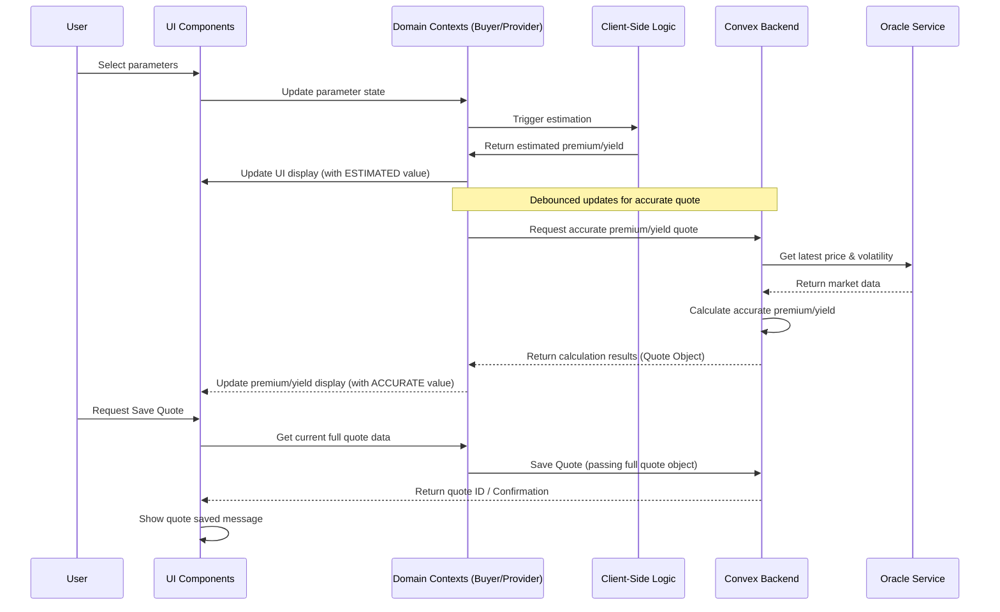

# UI Component Integration for Premium Parameters

**Version:** 1.1  
**Date:** 2024-08-20  
**Context:** Implementation details for connecting UI components to the Convex backend for premium calculations. (Incorporates architectural review feedback).

## 1. Overview

This document details the implementation plan for integrating the BitHedge UI components (`ProtectionParameters.tsx`, `BuyerParametersUI.tsx`, and `ProviderParametersUI.tsx`) with the Convex backend for premium calculations and quote generation. The focus is on establishing data flow using domain-specific contexts, synchronizing with price data, implementing a hybrid calculation approach (client-side estimation + Convex validation) for responsiveness, and enabling real-time premium updates.

## 2. Component Structure and Data Flow

### 2.1 Component Hierarchy

```
PremiumCalculatorTabs
└── ProtectionParameters
    ├── BuyerParametersUI (when role = 'buyer')
    │   ├── Protected Value Section
    │   ├── Protection Amount Section
    │   └── Protection Period Section
    └── ProviderParametersUI (when role = 'provider')
        ├── Risk-Reward Tier Section
        ├── Capital Commitment Section
        └── Income Period Section
```

### 2.2 Data Flow Diagram (Updated for Hybrid Approach)



## 3. Key Implementation Details

### 3.1 Implementing Domain-Specific Contexts

Instead of a single `PremiumDataContext`, create separate contexts:

```tsx
// src/contexts/BuyerContext.tsx
import { createContext, useContext, useState, useCallback } from "react";
// ... import types ...

interface BuyerContextProps {
  inputs: BuyerInputs;
  estimatedResult: BuyerEstimatedResult | null;
  accurateQuote: BuyerQuoteResult | null; // Full quote from Convex
  updateBuyerInputs: (updates: Partial<BuyerInputs>) => void;
  // ... other functions ...
}

const BuyerContext = createContext<BuyerContextProps | undefined>(undefined);

export const BuyerProvider = ({ children }) => {
  const [inputs, setInputs] = useState<BuyerInputs>(/* initial inputs */);
  const [estimatedResult, setEstimatedResult] =
    useState<BuyerEstimatedResult | null>(null);
  const [accurateQuote, setAccurateQuote] = useState<BuyerQuoteResult | null>(
    null
  );

  // Function to update inputs
  const updateBuyerInputs = useCallback((updates: Partial<BuyerInputs>) => {
    setInputs((prev) => ({ ...prev, ...updates }));
    // Trigger client-side estimation immediately
    // Trigger debounced accurate quote fetch
  }, []);

  // ... logic for estimation and fetching accurate quote ...

  return (
    <BuyerContext.Provider
      value={{
        inputs,
        estimatedResult,
        accurateQuote,
        updateBuyerInputs /*...*/,
      }}
    >
      {children}
    </BuyerContext.Provider>
  );
};

export const useBuyerContext = () => {
  const context = useContext(BuyerContext);
  if (!context)
    throw new Error("useBuyerContext must be used within a BuyerProvider");
  return context;
};

// --- Similarly create ProviderContext.tsx ---
```

### 3.2 Creating Robust Bitcoin Price Hook

Ensure the hook handles loading, errors, and provides necessary data.

```tsx
// src/hooks/useBitcoinPrice.ts
import { useQuery } from "convex/react";
import { api } from "../../convex/_generated/api";

export const useBitcoinPrice = () => {
  // Assuming api.prices.getLatestPrice returns an object with price, volatility, timestamp or null/undefined
  const aggregatedData = useQuery(api.prices.getLatestPrice);

  const isLoading = aggregatedData === undefined;
  const error = !isLoading && aggregatedData === null; // Basic error check

  return {
    currentPrice: aggregatedData?.price ?? 0,
    volatility: aggregatedData?.volatility ?? 0, // Provide volatility
    isLoading,
    error: error ? "Failed to load price data." : null,
    lastUpdated: aggregatedData?.timestamp ?? 0,
    // Consider adding a refetch function if needed
  };
};
```

### 3.3 Updating `BuyerParametersUI` (Hybrid Approach)

Use `BuyerContext`, implement client estimation, and debounced accurate fetch.

```tsx
// src/components/BitHedge/BuyerParametersUI.tsx
import { useEffect } from "react";
import { useBuyerContext } from "@/contexts/BuyerContext";
import { useBitcoinPrice } from "@/hooks/useBitcoinPrice";
import { useDebounce } from "@/hooks/useDebounce";
import { estimateBuyerPremium } from "@/utils/clientEstimation"; // NEW utility
import { useBuyerQuote } from "@/hooks/useBuyerQuote"; // Hook for accurate quote

const BuyerParametersUI = () => {
  const { inputs, updateBuyerInputs, setEstimatedResult, setAccurateQuote } =
    useBuyerContext();
  const {
    currentPrice,
    volatility,
    isLoading: isPriceLoading,
  } = useBitcoinPrice();
  const {
    fetchQuote,
    isLoading: isFetchingQuote,
    quote: accurateQuoteResult,
  } = useBuyerQuote();

  // Destructure inputs for easier use
  const { protectedValuePercentage, protectionAmount, protectionPeriod } =
    inputs;

  // --- Client-Side Estimation ---
  useEffect(() => {
    if (currentPrice > 0 && !isPriceLoading) {
      const estimated = estimateBuyerPremium({
        currentPrice,
        volatility,
        protectedValuePercentage,
        protectionAmount,
        protectionPeriod,
      });
      setEstimatedResult(estimated); // Update context with estimate
    }
  }, [
    currentPrice,
    volatility,
    protectedValuePercentage,
    protectionAmount,
    protectionPeriod,
    setEstimatedResult,
    isPriceLoading,
  ]);

  // --- Debounced Accurate Quote Fetch ---
  const debouncedInputs = useDebounce(inputs, 500); // Debounce the entire input object

  useEffect(() => {
    // Fetch accurate quote only when debounced inputs change and price is loaded
    if (
      currentPrice > 0 &&
      !isPriceLoading &&
      debouncedInputs.protectionAmount > 0
    ) {
      fetchQuote({
        protectedValuePercentage: debouncedInputs.protectedValuePercentage,
        protectionAmount: debouncedInputs.protectionAmount,
        expirationDays: debouncedInputs.protectionPeriod,
        policyType: "PUT", // Assuming PUT
      });
    }
  }, [debouncedInputs, currentPrice, isPriceLoading, fetchQuote]);

  // Update context with the accurate quote when it arrives
  useEffect(() => {
    if (accurateQuoteResult) {
      setAccurateQuote(accurateQuoteResult);
    }
  }, [accurateQuoteResult, setAccurateQuote]);

  // --- Event Handlers Update Context ---
  const handleProtectedValueChange = (newValue: number) => {
    updateBuyerInputs({ protectedValuePercentage: newValue });
  };
  // ... other handlers ...

  // --- Display Logic ---
  // Display estimatedResult immediately
  // Display accurateQuoteResult when available (potentially overriding estimate display)
  // Handle loading states (isPriceLoading, isFetchingQuote)
  // Handle errors from useBitcoinPrice and useBuyerQuote

  // Rest of component implementation
  // ...
};
```

### 3.4 Client-Side Estimation Utilities

Create simplified calculation logic for quick UI feedback.

```typescript
// src/utils/clientEstimation.ts

interface EstimationParams {
  currentPrice: number;
  volatility: number;
  // ... other params ...
}

export const estimateBuyerPremium = (params: EstimationParams) => {
  // Implement a VERY simplified Black-Scholes or heuristic
  // Focus on speed over perfect accuracy
  // Example (highly simplified):
  const timeFactor = Math.sqrt(params.protectionPeriod / 365);
  const estimatedPremium =
    params.currentPrice *
    params.volatility *
    timeFactor *
    params.protectionAmount *
    0.1; // Arbitrary scaling factor

  return {
    estimatedPremium: Math.max(0, estimatedPremium),
    // other estimated fields if needed
  };
};

// Add estimateProviderYield similarly
```

### 3.5 Accurate Quote Hooks

Create hooks to call the public-facing Convex quote queries.

```tsx
// src/hooks/useBuyerQuote.ts
import { useState, useCallback } from "react";
import { useQuery } from "convex/react";
import { api } from "../../convex/_generated/api";

interface BuyerQuoteParams {
  protectedValuePercentage: number;
  protectionAmount: number;
  expirationDays: number;
  policyType: string;
}

export const useBuyerQuote = () => {
  const [params, setParams] = useState<BuyerQuoteParams | null>(null);

  // Use useQuery for fetching, triggered when params change
  const quote = useQuery(api.premium.getBuyerPremiumQuote, params ?? "skip");

  const isLoading = params !== null && quote === undefined; // Loading only when params are set and data is undefined
  const error = params !== null && quote === null; // Basic error check

  const fetchQuote = useCallback((newParams: BuyerQuoteParams) => {
    setParams(newParams);
  }, []);

  return {
    quote,
    isLoading,
    error: error ? "Failed to fetch accurate quote." : null,
    fetchQuote,
  };
};

// Create useProviderQuote similarly
```

### 3.6 Quote Generation and Saving (Updated)

Save the full quote object returned by Convex.

```tsx
// src/components/BitHedge/PolicySummary.tsx
import { useState } from "react";
import { useMutation } from "convex/react";
import { api } from "../../convex/_generated/api";
import { useBuyerContext } from "@/contexts/BuyerContext";

export const PolicySummary = () => {
  const { accurateQuote } = useBuyerContext(); // Get the full quote object
  const [isSaving, setIsSaving] = useState(false);
  const [savedQuoteId, setSavedQuoteId] = useState<string | null>(null);
  const [saveError, setSaveError] = useState<string | null>(null);

  const saveQuoteMutation = useMutation(api.quotes.saveQuote);

  const handleSaveQuote = async () => {
    if (!accurateQuote) {
      setSaveError("No accurate quote available to save.");
      return;
    }

    setIsSaving(true);
    setSaveError(null);
    try {
      const result = await saveQuoteMutation({
        quoteType: "buyer",
        asset: "BTC",
        calculationResult: accurateQuote, // Pass the entire quote object
        metadata: {
          displayName: `BTC Protection ${accurateQuote.inputs?.protectionAmount || ""} - ${new Date().toLocaleDateString()}`,
          notes: "",
          tags: ["protection", "btc"],
        },
      });

      setSavedQuoteId(result.id);
      // Maybe show a success toast/message
    } catch (err) {
      console.error("Error saving quote:", err);
      setSaveError(
        err instanceof Error ? err.message : "Failed to save quote."
      );
      // Maybe show an error toast/message
    } finally {
      setIsSaving(false);
    }
  };

  // Render summary based on accurateQuote
  // Render save button with loading state (isSaving) and disable if !accurateQuote
  // Display saveError if present
  // ...
};
```

## 4. Validation and Error Handling

### 4.1 Input Validation

Use robust validation libraries (like `zod`) within context or UI handlers.

```typescript
// Example using zod within context update function
import { z } from "zod";

const BuyerInputsSchema = z.object({
  protectedValuePercentage: z.number().min(50).max(150),
  protectionAmount: z.number().positive().max(100),
  protectionPeriod: z.enum([30, 90, 180, 360]),
});

// Inside BuyerContext
const updateBuyerInputs = useCallback(
  (updates: Partial<BuyerInputs>) => {
    const newInputs = { ...inputs, ...updates };
    const validationResult = BuyerInputsSchema.safeParse(newInputs);
    if (!validationResult.success) {
      // Handle validation errors - maybe set an error state in context
      console.error("Validation failed:", validationResult.error.flatten());
      // Optionally prevent setting invalid inputs or show feedback
    }
    setInputs(newInputs); // Or set only if valid
    // ... trigger estimation etc. ...
  },
  [inputs]
);
```

### 4.2 Error Display Components

Ensure `ValidationError` can show errors from context or hooks.

```tsx
// src/components/common/ValidationError.tsx
import { Alert, AlertIcon, AlertTitle, Box, Collapse } from "@chakra-ui/react";

interface ValidationErrorProps {
  error: string | null | undefined;
}

export const ValidationError = ({ error }: ValidationErrorProps) => {
  return (
    <Collapse in={!!error} animateOpacity>
      <Box my={2}>
        <Alert status="error" borderRadius="md" py={2}>
          <AlertIcon />
          <AlertTitle fontSize="sm">{error}</AlertTitle>
        </Alert>
      </Box>
    </Collapse>
  );
};
```

### 4.3 Loading States

Combine loading states from `useBitcoinPrice` and quote hooks (`useBuyerQuote`/`useProviderQuote`).

```tsx
// Inside BuyerParametersUI
const overallLoading = isPriceLoading || isFetchingQuote;

// Use overallLoading to show CalculationLoader or disable inputs
<CalculationLoader isLoading={overallLoading} text="Fetching data..." />;
```

## 5. Performance Considerations

### 5.1 Debouncing Implementation

Use `useDebounce` hook effectively.

```tsx
// src/hooks/useDebounce.ts
import { useState, useEffect } from "react";

export function useDebounce<T>(value: T, delay: number): T {
  const [debouncedValue, setDebouncedValue] = useState<T>(value);

  useEffect(() => {
    const timer = setTimeout(() => {
      setDebouncedValue(value);
    }, delay);

    return () => {
      clearTimeout(timer);
    };
  }, [value, delay]);

  return debouncedValue;
}
```

Usage (as shown in `BuyerParametersUI` example):
Debounce the entire input object or specific critical inputs before triggering the accurate Convex quote fetch.

### 5.2 Memoization

Memoize complex display components that depend on calculation results.

```tsx
import { useMemo } from "react";
import { useBuyerContext } from "@/contexts/BuyerContext";

// Inside PolicySummary or similar
const { accurateQuote } = useBuyerContext();

const premiumBreakdown = useMemo(() => {
  if (!accurateQuote?.factorsBreakdown) {
    return null;
  }

  const { intrinsicValue, timeValue, volatilityImpact } =
    accurateQuote.factorsBreakdown;

  // Assuming PremiumBreakdownChart is a memoized component itself
  return (
    <PremiumBreakdownChart
      intrinsicValue={intrinsicValue}
      timeValue={timeValue}
      volatilityImpact={volatilityImpact}
    />
  );
}, [accurateQuote?.factorsBreakdown]);

// Render {premiumBreakdown}
```

## 6. Testing Strategy

### 6.1 Component Testing

Test components with mocked context providers and mocked Convex query results.

```tsx
// src/components/BitHedge/__tests__/BuyerParametersUI.test.tsx
import { render, screen, fireEvent, waitFor } from "@testing-library/react";
import { BuyerParametersUI } from "../BuyerParametersUI";
import { BuyerProvider } from "@/contexts/BuyerContext"; // Use the actual provider

// --- Mock Hooks ---
jest.mock("@/hooks/useBitcoinPrice", () => ({
  useBitcoinPrice: () => ({
    currentPrice: 50000,
    volatility: 0.03,
    isLoading: false,
    error: null,
  }),
}));

jest.mock("@/hooks/useBuyerQuote", () => ({
  useBuyerQuote: () => ({
    quote: { premium: 1250 /* ... other quote fields ... */ },
    isLoading: false,
    error: null,
    fetchQuote: jest.fn(),
  }),
}));

jest.mock("@/utils/clientEstimation", () => ({
  estimateBuyerPremium: jest.fn(() => ({ estimatedPremium: 1200 })),
}));

// --- Test Suite ---
describe("BuyerParametersUI", () => {
  test("renders and displays initial estimated premium", async () => {
    render(
      <BuyerProvider>
        <BuyerParametersUI />
      </BuyerProvider>
    );
    // Check if estimated premium is displayed based on mocks
    expect(
      await screen.findByText(/Estimated Premium: \$1,200/)
    ).toBeInTheDocument();
  });

  test("updates context and triggers fetch on input change", async () => {
    const mockFetchQuote = jest.fn();
    jest.mock("@/hooks/useBuyerQuote", () => ({
      // Re-mock inside test for specific mock function
      useBuyerQuote: () => ({
        quote: null,
        isLoading: false,
        error: null,
        fetchQuote: mockFetchQuote,
      }),
    }));

    render(
      <BuyerProvider>
        <BuyerParametersUI />
      </BuyerProvider>
    );

    const amountInput = screen.getByLabelText(/Protection Amount/i); // Use appropriate label
    fireEvent.change(amountInput, { target: { value: "0.5" } });

    // Check if fetchQuote was called after debounce
    await waitFor(
      () => {
        expect(mockFetchQuote).toHaveBeenCalled();
      },
      { timeout: 600 }
    ); // Wait longer than debounce period
  });

  // Add more tests: validation errors, loading states, accurate quote display
});
```

### 6.2 Integration Testing

Focus on testing the flow within the UI layer using mocked Convex responses.

```tsx
// src/tests/integration/PremiumCalculationFlow.test.tsx
import { render, screen, fireEvent, waitFor } from "@testing-library/react";
import { ConvexProvider, ConvexReactClient } from "convex/react";
import { App } from "@/App"; // Or the specific parent component

// Mock Convex Client Setup
const mockConvex = new ConvexReactClient("https://mock.convex.dev");
// You might need to intercept fetch/websocket calls or use a more sophisticated mocking library
// to control responses from api.premium.getBuyerPremiumQuote etc.

// Example using jest.spyOn if Convex calls go through a service layer
// jest.spyOn(convexService, 'getBuyerPremiumQuote').mockResolvedValue({ premium: 3000, ... });

describe("Premium Calculation Integration Flow", () => {
  test("updates accurate premium display after parameter change and debounce", async () => {
    // Setup mocks for Convex queries called during the flow
    // e.g., mock api.premium.getBuyerPremiumQuote response

    render(
      <ConvexProvider client={mockConvex}>
        {/* Wrap with necessary Context Providers */}
        <App />
      </ConvexProvider>
    );

    // Navigate to the calculator page if needed
    // Find and change an input (e.g., protection amount)
    const amountInput = await screen.findByLabelText(/Protection Amount/i);
    fireEvent.change(amountInput, { target: { value: "0.75" } });

    // Initially, estimated value might show (test this if desired)

    // Wait for debounced call and check for updated *accurate* premium display
    expect(
      await screen.findByText(/Premium: \$3,000/, {}, { timeout: 1000 })
    ).toBeInTheDocument();
  });

  // Add tests for saving quotes, error flows etc.
});
```

## 7. Next Steps and Future Enhancements

### 7.1 Premium Visualization Components

### 7.2 Advanced User Flows

### 7.3 User Preferences and History

## 8. Conclusion

This updated implementation plan incorporates architectural feedback, emphasizing domain-specific contexts, a hybrid client/server calculation approach for improved responsiveness, and robust integration patterns. By following this approach, the BitHedge platform will offer users a seamless, real-time premium calculation experience that dynamically responds to parameter changes while maintaining optimal performance and clear error handling.
