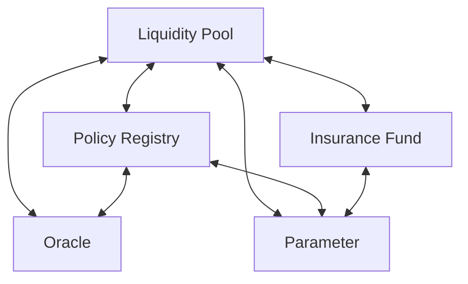

# The Bitcoin Insurance Company: Smart Contract Implementation Plan

## Executive Summary

This document outlines the smart contract implementation plan for The Bitcoin Insurance Company (BitHedge) platform. Based on an analysis of the project requirements, we'll follow the "Assisted Counterparty Model" for the MVP phase, focusing on creating a smart contract liquidity pool that serves as a counterparty to all protection policies. This approach provides a better initial user experience, reduces development complexity, and solves the cold start liquidity problem.

The implementation plan follows a phased approach, prioritizing the core functionality needed to create a working system where Income Irenes can deposit funds as collateral and Protective Peters can purchase protection policies. The plan is designed to be modular, allowing for progressive feature additions and eventual transition to a hybrid P2P model.

## Core Smart Contract Architecture

### Contract Components

The BitHedge platform will consist of the following primary smart contracts:

1. **Liquidity Pool** - Manages provider deposits and collateral requirements
2. **Policy Registry** - Handles policy creation, activation, and lifecycle management
3. **Oracle** - Provides reliable price data for Bitcoin and settlement calculations
4. **Parameter** - Stores and manages configurable system parameters
5. **Insurance Fund** - Provides a safety net for extreme market conditions

Additional supporting contracts will be implemented in later phases:

6. **Governance** - Controls system parameters and upgrades
7. **Incentives** - Manages rewards and token distribution
8. **Treasury** - Manages platform revenue and protocol-owned assets
9. **Liquidation Engine** - Handles collateral management during shortfalls

### Contract Relationships



## Implementation Phases

### Phase 1: Core Functionality (MVP)

#### 1.1 Liquidity Pool Contract

The Liquidity Pool contract is the central component of the assisted counterparty model, managing deposits from protection providers (Income Irenes) and ensuring sufficient collateralization for all protection policies.

**Key Features:**

- Provider deposit functionality (STX and sBTC)
- Risk tier management
- Collateralization tracking
- Yield distribution
- Premium collection and management

**Primary Functions:**

- `deposit-stx(amount)` - Allow providers to deposit STX as collateral
- `deposit-sbtc(amount)` - Allow providers to deposit sBTC as collateral
- `withdraw-stx(amount)` - Allow providers to withdraw available STX
- `withdraw-sbtc(amount)` - Allow providers to withdraw available sBTC
- `lock-collateral(amount, policy-id)` - Lock collateral for a specific policy
- `release-collateral(amount, policy-id)` - Release collateral when policy expires or is settled
- `calculate-premium(protected-value, protected-amount, duration, policy-type)` - Calculate premium for a protection policy
- `allocate-yield(policy-id, premium-amount)` - Distribute yield to providers based on collateral contribution

#### 1.2 Policy Registry Contract

The Policy Registry contract manages the lifecycle of all protection policies, from creation through activation, settlement, and expiration.

**Key Features:**

- Policy creation and tracking
- Policy activation (exercise)
- Policy expiration handling
- Settlement processing

**Primary Functions:**

- `create-policy(protected-value, expiration-height, protected-amount, premium, policy-type)` - Create a new protection policy
- `activate-policy(policy-id, exercise-price)` - Activate a policy when protection conditions are met
- `expire-policy(policy-id)` - Handle policy expiration
- `settle-policy(policy-id, settlement-amount)` - Process settlement when a policy is activated
- `get-policy-details(policy-id)` - Retrieve details of a specific policy
- `get-policies-by-owner(owner)` - Get all policies owned by a specific user
- `get-policies-by-provider(provider)` - Get all policies backed by a specific provider

#### 1.3 Oracle Contract

The Oracle contract provides reliable price data for Bitcoin and other assets, essential for policy creation, activation, and settlement.

**Key Features:**

- Price data aggregation
- Deviation checking
- Historical price tracking
- Volatility calculation

**Primary Functions:**

- `update-btc-price(price, timestamp)` - Update the current Bitcoin price
- `get-current-btc-price()` - Get the most recent Bitcoin price
- `get-btc-price-at-height(block-height)` - Get Bitcoin price at a specific block height
- `get-btc-volatility()` - Get current Bitcoin volatility metrics
- `is-price-valid(price)` - Validate if a price is within acceptable deviation parameters

#### 1.4 Parameter Contract

The Parameter contract stores and manages all configurable system parameters, allowing for governance-controlled updates to system behavior.

**Key Features:**

- System parameter storage
- Access control
- Version tracking
- Parameter validation

**Primary Functions:**

- `set-parameter(param-name, param-value)` - Update a system parameter
- `get-parameter(param-name)` - Retrieve a system parameter
- `get-fee-structure()` - Get current fee structure
- `get-collateralization-requirements()` - Get collateralization requirements
- `get-duration-limits()` - Get policy duration limits

### Phase 2: Enhanced Features

In Phase 2, we'll build upon the core functionality to add more sophisticated features:

1. **Insurance Fund Contract** - Safety net for extreme market conditions
2. **Improved Risk Management** - Advanced collateral management and tiered risk models
3. **Policy Transfer Capabilities** - Allow users to transfer active policies
4. **Enhanced Yield Distribution** - More sophisticated yield allocation algorithms

### Phase 3: Full Ecosystem

In Phase 3, we'll implement the remaining components to create a complete ecosystem:

1. **Governance Contract** - Decentralized control of system parameters
2. **Incentives Contract** - Rewards and token distribution
3. **P2P Order Book** - Direct matching of protection buyers and providers
4. **Secondary Market** - Trading of active protection policies

## Implementation Plan for Phase 1 (MVP)

### Development Priorities

| Priority | Component               | Features                                           | Timeline |
| -------- | ----------------------- | -------------------------------------------------- | -------- |
| 1        | Liquidity Pool (Basic)  | Deposit/withdraw, collateral tracking              | Week 1-2 |
| 2        | Policy Registry (Basic) | Policy creation, activation, expiration            | Week 2-3 |
| 3        | Oracle (Basic)          | Price updates, retrieval                           | Week 3-4 |
| 4        | Parameter (Basic)       | Parameter storage and retrieval                    | Week 4   |
| 5        | Integration Testing     | End-to-end policy lifecycle testing                | Week 5-6 |
| 6        | Advanced Features       | Yield distribution, premium calculation refinement | Week 6-8 |

### Detailed Task Breakdown for MVP

#### Week 1-2: Liquidity Pool (Basic)

1. Implement data structures for provider deposits
2. Implement deposit/withdraw functions
3. Create risk tier management system
4. Build collateral locking/unlocking mechanisms
5. Implement basic premium collection

#### Week 2-3: Policy Registry (Basic)

1. Implement policy data structures
2. Create policy creation functionality
3. Build policy activation mechanism
4. Implement expiration handling
5. Create basic settlement logic

#### Week 3-4: Oracle (Basic)

1. Implement price data storage
2. Create price update mechanism
3. Build validation logic
4. Implement historical price tracking
5. Create volatility calculation

#### Week 4: Parameter Contract

1. Implement parameter storage
2. Create access control
3. Build parameter validation
4. Implement version tracking

#### Week 5-6: Integration Testing

1. Test complete policy lifecycle
2. Verify collateral requirements
3. Test settlement calculations
4. Verify yield distribution

#### Week 6-8: Advanced Features

1. Enhance yield distribution algorithms
2. Refine premium calculation based on risk factors
3. Implement more sophisticated collateral management
4. Add portfolio management features

## Smart Contract Details

### Liquidity Pool Contract

```clarity
;; Liquidity Pool Contract
;; Manages provider deposits and policy collateralization

;; Constants
(define-constant ERR-NOT-AUTHORIZED (err u100))
(define-constant ERR-POOL-NOT-INITIALIZED (err u101))
(define-constant ERR-INSUFFICIENT-FUNDS (err u102))
(define-constant ERR-INSUFFICIENT-COLLATERAL (err u103))

;; Data Variables
(define-data-var pool-initialized bool false)
(define-data-var total-stx-collateral uint u0)
(define-data-var total-sbtc-collateral uint u0)
(define-data-var stx-locked uint u0)
(define-data-var sbtc-locked uint u0)

;; Data Maps
;; Provider deposits (Income Irene)
(define-map provider-deposits
  { provider: principal }
  {
    stx-amount: uint,
    sbtc-amount: uint,
    stx-locked: uint,
    sbtc-locked: uint,
    risk-tier: (string-ascii 20),
    last-deposit-height: uint,
    yield-earned: uint
  }
)

;; Risk tiers configuration
(define-map risk-tiers
  { tier-name: (string-ascii 20) }
  {
    min-protected-value-percentage: uint,
    max-protected-value-percentage: uint,
    premium-multiplier: uint,
    max-duration-days: uint,
    status: bool
  }
)

;; Provider backed policies
(define-map provider-backed-policies
  { provider: principal }
  { policy-ids: (list 250 uint) }
)

;; Public Functions

;; Initialize the pool with default settings
(define-public (initialize-pool)
  (begin
    (asserts! (not (var-get pool-initialized)) ERR-NOT-AUTHORIZED)

    ;; Setup default risk tiers
    (map-set risk-tiers
      { tier-name: "Conservative" }
      {
        min-protected-value-percentage: u800000,  ;; 80% of current price
        max-protected-value-percentage: u900000,  ;; 90% of current price
        premium-multiplier: u800000,              ;; 80% of standard premium
        max-duration-days: u30,                   ;; 30 days max
        status: true                              ;; active
      }
    )

    (var-set pool-initialized true)
    (ok true)
  )
)

;; Deposit STX collateral to the pool
(define-public (deposit-stx (amount uint))
  (let
    (
      (provider tx-sender)
      (provider-data (default-to
        {
          stx-amount: u0,
          sbtc-amount: u0,
          stx-locked: u0,
          sbtc-locked: u0,
          risk-tier: "Moderate",
          last-deposit-height: u0,
          yield-earned: u0
        }
        (map-get? provider-deposits { provider: provider })
      ))
    )

    (asserts! (var-get pool-initialized) ERR-POOL-NOT-INITIALIZED)
    (asserts! (> amount u0) ERR-INSUFFICIENT-FUNDS)

    ;; Transfer STX from provider to contract
    (try! (stx-transfer? amount tx-sender (as-contract tx-sender)))

    ;; Update provider deposit data
    (map-set provider-deposits
      { provider: provider }
      {
        stx-amount: (+ (get stx-amount provider-data) amount),
        sbtc-amount: (get sbtc-amount provider-data),
        stx-locked: (get stx-locked provider-data),
        sbtc-locked: (get sbtc-locked provider-data),
        risk-tier: (get risk-tier provider-data),
        last-deposit-height: block-height,
        yield-earned: (get yield-earned provider-data)
      }
    )

    ;; Update pool total
    (var-set total-stx-collateral (+ (var-get total-stx-collateral) amount))

    (ok amount)
  )
)

;; Additional functions to be implemented:
;; - deposit-sbtc
;; - withdraw-stx
;; - withdraw-sbtc
;; - update-risk-tier
;; - lock-collateral
;; - release-collateral
;; - calculate-premium
;; - allocate-yield
```

### Policy Registry Contract

```clarity
;; Policy Registry Contract
;; Manages the lifecycle of protection policies

;; Constants
(define-constant ERR-NOT-AUTHORIZED (err u100))
(define-constant ERR-POLICY-NOT-FOUND (err u101))
(define-constant ERR-INVALID-PARAMETERS (err u102))
(define-constant ERR-INSUFFICIENT-FUNDS (err u103))
(define-constant ERR-POLICY-EXPIRED (err u104))
(define-constant ERR-ACTIVATION-CONDITION-NOT-MET (err u105))

;; Data Variables
(define-data-var policy-counter uint u0)
(define-data-var total-active-policies uint u0)
(define-data-var total-protected-value uint u0)
(define-data-var total-premium-collected uint u0)

;; Data Maps
;; Primary policy data structure
(define-map policies
  { policy-id: uint }
  {
    owner: principal,
    protected-value: uint,
    expiration-height: uint,
    protected-amount: uint,
    premium: uint,
    policy-type: (string-ascii 4),
    creation-height: uint,
    status: uint,
    exercise-price: uint,
    exercise-height: uint
  }
)

;; Policies by owner
(define-map policies-by-owner
  { owner: principal }
  { policy-ids: (list 250 uint) }
)

;; Public Functions

;; Create a new protection policy
(define-public (create-policy
    (protected-value uint)
    (expiration-height uint)
    (protected-amount uint)
    (premium uint)
    (policy-type (string-ascii 4)))
  (let
    (
      (new-policy-id (+ (var-get policy-counter) u1))
      (current-height block-height)
    )

    ;; Validate parameters
    (asserts! (and
      (> protected-value u0)
      (> protected-amount u0)
      (> premium u0)
      (> expiration-height current-height)
      (or (is-eq policy-type "PUT") (is-eq policy-type "CALL")))
      ERR-INVALID-PARAMETERS)

    ;; Transfer premium from buyer to contract
    (try! (stx-transfer? premium tx-sender (as-contract tx-sender)))

    ;; Ensure sufficient collateral via liquidity pool
    (try! (contract-call? .liquidity-pool lock-collateral protected-value protected-amount policy-type new-policy-id))

    ;; Create the new policy
    (map-set policies
      { policy-id: new-policy-id }
      {
        owner: tx-sender,
        protected-value: protected-value,
        expiration-height: expiration-height,
        protected-amount: protected-amount,
        premium: premium,
        policy-type: policy-type,
        creation-height: current-height,
        status: u0, ;; Active
        exercise-price: u0,
        exercise-height: u0
      }
    )

    ;; Update policy counter
    (var-set policy-counter new-policy-id)

    ;; Update total stats
    (var-set total-active-policies (+ (var-get total-active-policies) u1))
    (var-set total-protected-value (+ (var-get total-protected-value) protected-value))
    (var-set total-premium-collected (+ (var-get total-premium-collected) premium))

    ;; Update owner's policy index
    (add-policy-to-owner tx-sender new-policy-id)

    ;; Allocate premium to providers through liquidity pool
    (try! (contract-call? .liquidity-pool allocate-premium new-policy-id premium))

    (ok new-policy-id)
  )
)

;; Activate (exercise) a policy
(define-public (activate-policy
    (policy-id uint)
    (exercise-price uint))
  (let
    (
      (policy (unwrap! (map-get? policies { policy-id: policy-id }) ERR-POLICY-NOT-FOUND))
      (current-height block-height)
    )

    ;; Check policy ownership
    (asserts! (is-eq tx-sender (get owner policy)) ERR-NOT-AUTHORIZED)

    ;; Check if policy is still active and not expired
    (asserts! (is-eq (get status policy) u0) ERR-POLICY-NOT-FOUND)
    (asserts! (<= current-height (get expiration-height policy)) ERR-POLICY-EXPIRED)

    ;; Validate activation condition
    (asserts!
      (if (is-eq (get policy-type policy) "PUT")
        (< exercise-price (get protected-value policy))
        (> exercise-price (get protected-value policy))
      )
      ERR-ACTIVATION-CONDITION-NOT-MET)

    ;; Calculate settlement amount
    (let
      ((settlement-amount (calculate-settlement-amount policy exercise-price)))

      ;; Process settlement via liquidity pool
      (try! (contract-call? .liquidity-pool process-settlement policy-id settlement-amount))

      ;; Update policy status to exercised
      (map-set policies
        { policy-id: policy-id }
        (merge policy {
          status: u1, ;; Exercised
          exercise-price: exercise-price,
          exercise-height: current-height
        })
      )

      ;; Update total stats
      (var-set total-active-policies (- (var-get total-active-policies) u1))

      (ok settlement-amount)
    )
  )
)

;; Helper function to calculate settlement amount
(define-private (calculate-settlement-amount (policy {
    owner: principal,
    protected-value: uint,
    expiration-height: uint,
    protected-amount: uint,
    premium: uint,
    policy-type: (string-ascii 4),
    creation-height: uint,
    status: uint,
    exercise-price: uint,
    exercise-height: uint
  }) (current-price uint))
  (if (is-eq (get policy-type policy) "PUT")
    ;; For PUT: (protected_value - current_price) * protected_amount / protected_value
    (/ (* (- (get protected-value policy) current-price) (get protected-amount policy)) (get protected-value policy))
    ;; For CALL: (current_price - protected_value) * protected_amount / protected_value
    (/ (* (- current-price (get protected-value policy)) (get protected-amount policy)) (get protected-value policy))
  )
)

;; Additional functions to be implemented:
;; - expire-policy
;; - add-policy-to-owner
;; - get-policy-details
;; - get-policies-by-owner
```

### Oracle Contract

```clarity
;; Oracle Contract
;; Provides reliable price data for Bitcoin and other assets

;; Constants
(define-constant ERR-NOT-AUTHORIZED (err u100))
(define-constant ERR-INVALID-PARAMETERS (err u101))
(define-constant ERR-NO-PRICE-DATA (err u102))
(define-constant ERR-PRICE-DEVIATION-TOO-HIGH (err u103))

;; Data Variables
(define-data-var oracle-initialized bool false)
(define-data-var current-btc-price uint u0)
(define-data-var current-btc-price-timestamp uint u0)
(define-data-var current-btc-volatility uint u0)
(define-data-var oracle-admin principal tx-sender)

;; Data Maps
;; Historical price data
(define-map historical-btc-prices
  { block-height: uint }
  {
    price: uint,
    timestamp: uint
  }
)

;; Public Functions

;; Initialize the oracle
(define-public (initialize-oracle)
  (begin
    (asserts! (not (var-get oracle-initialized)) ERR-NOT-AUTHORIZED)
    (var-set oracle-initialized true)
    (var-set oracle-admin tx-sender)
    (ok true)
  )
)

;; Update Bitcoin price (restricted to oracle admin)
(define-public (update-btc-price (price uint) (timestamp uint))
  (begin
    (asserts! (var-get oracle-initialized) ERR-INVALID-PARAMETERS)
    (asserts! (is-eq tx-sender (var-get oracle-admin)) ERR-NOT-AUTHORIZED)
    (asserts! (> price u0) ERR-INVALID-PARAMETERS)
    (asserts! (> timestamp u0) ERR-INVALID-PARAMETERS)

    ;; Store historical price
    (map-set historical-btc-prices
      { block-height: block-height }
      {
        price: price,
        timestamp: timestamp
      }
    )

    ;; Update current price
    (var-set current-btc-price price)
    (var-set current-btc-price-timestamp timestamp)

    ;; Calculate and update volatility
    (var-set current-btc-volatility (calculate-btc-volatility))

    (ok true)
  )
)

;; Get current Bitcoin price
(define-read-only (get-current-btc-price)
  (ok {
    price: (var-get current-btc-price),
    timestamp: (var-get current-btc-price-timestamp),
    volatility: (var-get current-btc-volatility)
  })
)

;; Calculate Bitcoin volatility (simplified)
(define-private (calculate-btc-volatility)
  ;; This is a simplified placeholder
  ;; A real implementation would analyze historical price data
  ;; and calculate standard deviation or other volatility metrics
  u100000 ;; 10% (scaled by 1,000,000)
)

;; Additional functions to be implemented:
;; - get-btc-price-at-height
;; - validate-price
;; - add-oracle-provider
;; - update-volatility-window
```

## Critical Technical Considerations

### 1. Collateralization Requirements

Ensuring proper collateralization is critical for the integrity of the system. The implementation will:

- Require 100% collateralization for all protection policies
- Lock collateral when policies are created
- Release collateral when policies expire or are settled
- Implement proper accounting to track available vs. locked collateral

### 2. Price Oracle Security

The price oracle is a critical component and potential attack vector. The implementation will:

- Use multiple price sources where possible
- Implement deviation checking
- Add time-weighted average prices
- Include circuit breakers for extreme price movements

### 3. Fund Management Security

Proper handling of user funds is paramount. The implementation will:

- Use well-established Clarity patterns for fund management
- Implement proper access controls
- Include emergency pause functionality
- Conduct thorough testing and auditing

### 4. Risk Parameters

The system's risk parameters need careful calibration. The implementation will:

- Start with conservative parameters
- Implement governance-controlled parameter updates
- Include validation checks for parameter changes
- Provide clear documentation of parameter impacts

## Next Steps

1. **Development Setup**: Establish the development environment and testing framework
2. **Liquidity Pool Implementation**: Focus on the core deposit/withdraw functionality
3. **Policy Registry Implementation**: Implement basic policy creation and lifecycle
4. **Integration Testing**: Test the interaction between Liquidity Pool and Policy Registry
5. **Oracle Implementation**: Build reliable price feeds
6. **UI Integration Testing**: Test the contracts with the frontend interface

## Conclusion

This implementation plan provides a clear roadmap for developing the BitHedge smart contract layer according to the Assisted Counterparty Model. By focusing first on the core functionality needed for the MVP, we can quickly deliver a working system that enables Income Irenes to deposit funds as collateral and Protective Peters to purchase protection policies.

The modular design allows for progressive feature additions and the eventual transition to a hybrid P2P model, aligning with the project's long-term vision of a fully decentralized options marketplace built on Bitcoin and Stacks.
