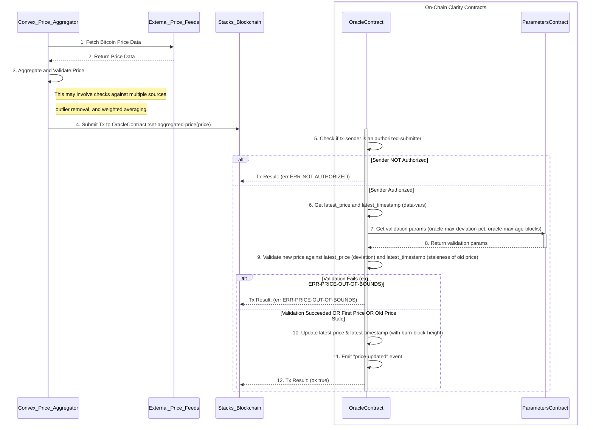
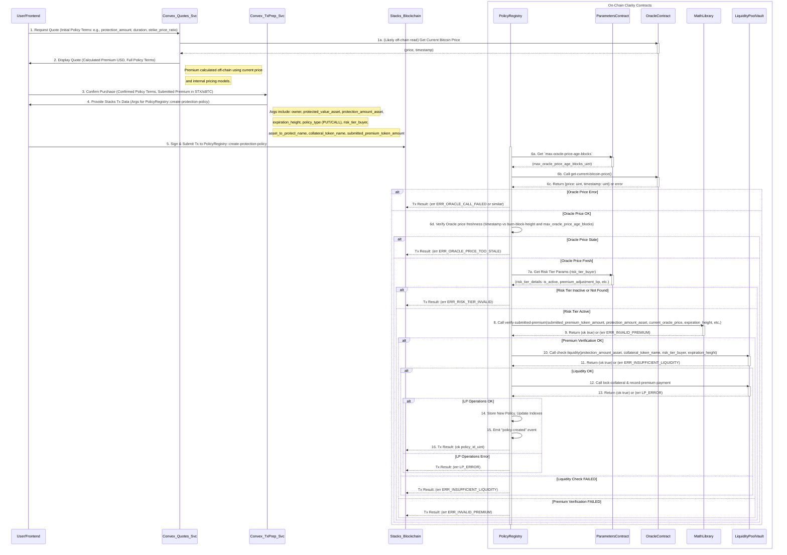
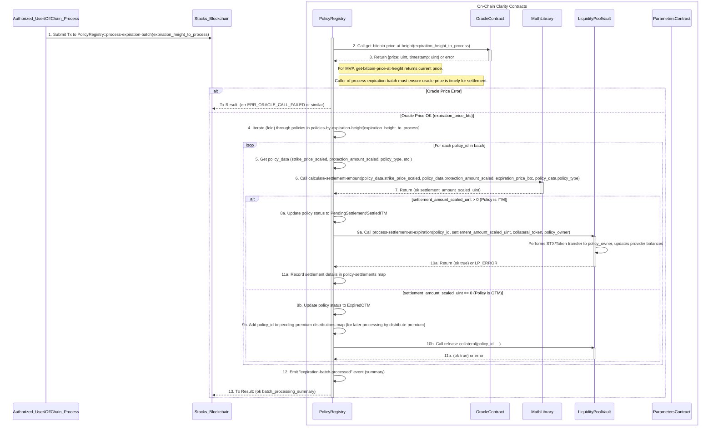

# Bitcoin Price Data Flow Report

## Introduction

This document outlines the flow of Bitcoin price data within the BitHedge smart contract ecosystem and its interaction with the off-chain Convex layer. Accurate and timely Bitcoin price data is critical for several core functions, including premium calculation, policy creation, and settlement processing. Understanding this data flow is essential for analyzing the system's reliability and integrity.

## Key Components Involved

### On-Chain (Clarity Smart Contracts)

- **`oracle.clar`**: The primary source of Bitcoin price data on the Stacks blockchain. It allows an authorized off-chain service (Convex) to submit price updates and provides functions for other smart contracts to retrieve the latest price.
- **`policy-registry.clar`**: Manages the lifecycle of insurance policies. It consumes Bitcoin price data during:
  - Policy Creation: For premium verification (indirectly via `math-library.clar`).
  - Policy Settlement: To determine if policies are In-The-Money (ITM) or Out-of-The-Money (OTM) and to calculate settlement amounts.
- **`math-library.clar`**: Contains functions for financial calculations. It uses Bitcoin price data passed to it by other contracts (e.g., `policy-registry.clar`) for premium verification and settlement amount calculations.
- **`liquidity-pool-vault.clar`**: Manages the capital pool for underwriting policies. It executes the financial aspects of settlement based on instructions from `policy-registry.clar`, which are derived from price data.
- **`bithedge-parameters.clar`**: Stores system-wide configuration parameters, including those that govern the behavior of the `oracle.clar` contract (e.g., maximum price deviation, maximum price age for updates within the oracle).

### Off-Chain (Convex Layer)

- **Convex Price Aggregator/Submitter**: An off-chain service responsible for fetching Bitcoin price data from multiple external sources, aggregating it, and submitting it to the `oracle.clar` smart contract via the `set-aggregated-price` function.
- **Convex Quoting Service**: An off-chain service that likely uses the Bitcoin price (read from `oracle.clar` or another trusted off-chain source) to provide indicative quotes for insurance policy premiums to users.
- **Convex Transaction Preparation Service**: Prepares the transaction parameters for on-chain interactions, such as creating a policy.

## Data Flow Diagrams and Explanations

### 1. Bitcoin Price Update by Convex Layer

This diagram illustrates how the Convex layer fetches, validates, and submits the Bitcoin price to the `oracle.clar` contract.

**Explanation:**

1.  **Fetch Price Data**: The Convex Price Aggregator service queries multiple external price feeds (e.g., major exchanges, data providers) to obtain current Bitcoin price information.
2.  **Return Price Data**: External feeds provide their price data to the aggregator.
3.  **Aggregate and Validate Price**: The Convex service processes the collected data. This step is crucial and likely involves:
    - **Normalization**: Ensuring prices are in a consistent format (e.g., USD with a fixed number of decimals).
    - **Validation**: Checking for anomalies, stale data from individual feeds, or significant divergences between feeds.
    - **Aggregation**: Calculating a single, reliable price point (e.g., median, volume-weighted average).
4.  **Submit Transaction**: The authorized Convex submitter calls the `set-aggregated-price(price)` function on the `oracle.clar` contract. The `price` argument is the validated price from step 3. The `timestamp` is implicitly the `burn-block-height` at which the transaction is processed.
5.  **Authorization Check**: `oracle.clar` verifies that `tx-sender` is a principal present in its `authorized-submitters` map.
6.  **Get Current On-Chain Price**: The oracle retrieves its currently stored `latest-price` and `latest-timestamp`.
7.  **Get Validation Parameters**: The oracle calls the `BitHedgeParametersContract` (if configured) via `get-parameter-from-contract` to fetch `oracle-max-deviation-pct` (maximum allowed percentage difference from the last price) and `oracle-max-age-blocks` (how old the last price can be before it's considered stale for deviation check purposes).
8.  **Return Validation Parameters**: The `BitHedgeParametersContract` returns the requested parameters.
9.  **Validate New Price**: The `oracle.clar` contract performs validation:
    - If it's the first price ever submitted (`latest-price` is `u0`), validation is skipped.
    - Otherwise, it calculates the percentage deviation between the new `price` and `last-price-val`.
    - It checks if `last-timestamp-val` is older than `current-timestamp - max-age-blocks-val`. If the old price is stale, the deviation check might be bypassed (allowing larger jumps if the oracle hasn't been updated in a while).
    - If the old price is not stale, the deviation must be within `max-deviation-pct-val`.
10. **Update Oracle State**: If validation passes, `oracle.clar` updates `latest-price` to the new `price` and `latest-timestamp` to the current `burn-block-height`.
11. **Emit Event**: A `price-updated` event is emitted, logging the new price, timestamp, and submitter.
12. **Transaction Result**: The transaction concludes, returning `(ok true)` on success or an error code if any check fails.

### 2. Policy Creation - Premium Verification & Liquidity Check

This diagram shows how Bitcoin price data is used when a user creates a new protection policy. The price data is indirectly used by the `math-library.clar` for premium verification and then by `policy-registry.clar` in its interactions.

**Explanation:**

1.  **Request Quote (Off-chain)**: The user requests a premium quote from the Convex Quoting Service, providing initial desired policy parameters.
    - **1a. Convex Reads Price**: The Convex Quoting Service likely reads the current Bitcoin price from `oracle.clar` (or its own trusted off-chain feed that is expected to be in sync with the on-chain oracle) to calculate the premium.
2.  **Display Quote (Off-chain)**: Convex calculates and displays an indicative premium and the full policy terms to the user. This premium is typically denominated in USD but will be paid in STX or sBTC.
3.  **Confirm Purchase (Off-chain)**: The user agrees to the terms and confirms the purchase. They will specify the amount of `submitted_premium_token_amount` (e.g., in STX or sBTC) they are willing to pay, which should correspond to the quoted premium.
4.  **Provide Transaction Data (Off-chain)**: The Convex Transaction Preparation Service constructs the arguments needed for the `PolicyRegistry::create-protection-policy` on-chain function call.
5.  **Submit Transaction**: The user signs and submits the transaction to the Stacks blockchain, calling `create-protection-policy`.
6.  **Policy Registry - Oracle Interaction & Freshness Check**:
    - **6a. Get Max Oracle Age**: `PolicyRegistry` first calls `ParametersContract` to get `max-oracle-price-age-blocks`.
    - **6b. Get Current Oracle Price**: `PolicyRegistry` calls `OracleContract::get-current-bitcoin-price()` to get the `{price: uint, timestamp: uint}`.
    - **6c. Oracle Response**: `OracleContract` returns the price data.
    - **6d. Verify Oracle Price Freshness**: `PolicyRegistry` checks if the `timestamp` from the oracle is not older than `burn-block-height - max_oracle_price_age_blocks`. If it's too old, the transaction fails.
7.  **Policy Registry - Parameters Interaction (Risk Tier)**:
    - **7a. Get Risk Tier Parameters**: `PolicyRegistry` calls `ParametersContract` to fetch details for the `risk_tier_buyer` specified by the user (e.g., activity status, premium adjustment basis points).
8.  **Call `verify-submitted-premium`**: `PolicyRegistry` calls `MathLibrary::verify-submitted-premium`. This function takes the `submitted_premium_token_amount`, key policy terms, the `current_oracle_price` (obtained in step 6c), and risk tier details. The `MathLibrary` uses these inputs, especially the `current_oracle_price`, to determine if the `submitted_premium_token_amount` is acceptable (e.g., within a certain tolerance of an on-chain calculated expected premium based on the current oracle price and risk factors).
9.  **Return Premium Verification Result**: `MathLibrary` returns `(ok true)` or an error like `(err ERR_INVALID_PREMIUM)`.
10. **Call `check-liquidity`**: If premium verification is successful, `PolicyRegistry` calls `LiquidityPoolVault::check-liquidity`. This function assesses if there's enough available capital in the pool to underwrite the policy, considering the `protection_amount_asset`, `collateral_token_name`, `risk_tier_buyer`, and `expiration_height`.
11. **Return Liquidity Check Result**: `LiquidityPoolVault` returns `(ok true)` or `(err ERR_INSUFFICIENT_LIQUIDITY)`.
12. **Call `lock-collateral` & `record-premium-payment`**: If liquidity is sufficient, `PolicyRegistry` calls functions on `LiquidityPoolVault` to lock the required collateral from providers and record the premium payment from the user.
13. **Return LP Operation Result**: `LiquidityPoolVault` returns the outcome of these operations.
14. **Store New Policy**: If all preceding steps are successful, `PolicyRegistry` creates a new policy record, updates relevant indexes (e.g., `policies-by-expiration-height`).
15. **Emit Event**: `PolicyRegistry` emits a `policy-created` event.
16. **Transaction Result**: The transaction completes, returning `(ok policy_id_uint)` or an error from any of the failing steps.

### 3. Policy Settlement at Expiration

This diagram outlines how Bitcoin price data from the `oracle.clar` contract is used by `policy-registry.clar` to process policies at their expiration, determine their moneyness, and calculate settlement amounts.

**Explanation:**

1.  **Submit Batch Processing Transaction**: An authorized user or an automated off-chain process (keeper bot) calls `PolicyRegistry::process-expiration-batch(expiration_height_to_process)` for a specific block height at which policies are expiring.
2.  **Get Bitcoin Price at Expiration**: `PolicyRegistry` calls `OracleContract::get-bitcoin-price-at-height(expiration_height_to_process)`.
    - **Note**: In the current MVP (`oracle.clar` v2.0.8), `get-bitcoin-price-at-height` simply calls `get-current-bitcoin-price`. This means the price used for settlement is the latest price available in the oracle _at the time `process-expiration-batch` is called_. The off-chain process initiating this batch must be responsible for ensuring the oracle's price is timely and appropriate for settling policies expiring at `expiration_height_to_process`.
3.  **Oracle Response**: `OracleContract` returns the `{price: uint, timestamp: uint}` (which is the current price for MVP).
4.  **Iterate Through Policies**: `PolicyRegistry` retrieves the list of policy IDs scheduled to expire at `expiration_height_to_process` from its `policies-by-expiration-height` map and iterates through them.
5.  **Get Policy Data**: For each `policy_id`, `PolicyRegistry` fetches its stored data (strike price, protection amount, policy type, etc.).
6.  **Calculate Settlement Amount**: `PolicyRegistry` calls `MathLibrary::calculate-settlement-amount`. This function takes the policy's strike price, protection amount, the `expiration_price_btc` (obtained in step 3), and policy type (PUT/CALL) to determine the payout amount, if any. For example, for a PUT option, it would be `max(0, strike_price - expiration_price_btc) * units` (simplified).
7.  **Return Settlement Amount**: `MathLibrary` returns the calculated `settlement_amount_scaled_uint`.
8.  **Process Policy Based on Moneyness**:
    - **If ITM (In-The-Money)** (`settlement_amount_scaled_uint > 0`):
      - **8a. Update Status**: `PolicyRegistry` updates the policy's status (e.g., to `STATUS-SETTLED-ITM`).
      - **9a. Call `process-settlement-at-expiration`**: `PolicyRegistry` calls `LiquidityPoolVault::process-settlement-at-expiration`, providing the `policy_id`, `settlement_amount_scaled_uint`, collateral token details, and the `policy_owner` (beneficiary).
      - **10a. LP Executes Settlement**: `LiquidityPoolVault` transfers the `settlement_amount_scaled_uint` from the locked collateral to the policy owner and updates the balances of the liquidity providers who backed this policy.
      - **11a. Record Settlement**: `PolicyRegistry` records the details of this settlement (e.g., actual settlement price used, amount paid) in its `policy-settlements` map.
    - **If OTM (Out-of-The-Money)** (`settlement_amount_scaled_uint == 0`):
      - **8b. Update Status**: `PolicyRegistry` updates the policy's status (e.g., to `STATUS-EXPIRED-OTM`).
      - **9b. Queue for Premium Distribution**: The `policy_id` is added to the `pending-premium-distributions` map. The actual distribution of collected premiums to providers for OTM policies is typically handled by a separate function (e.g., `distribute-premium` or `distribute-premium-batch`) that can be called later.
      - **10b. Release Collateral**: `PolicyRegistry` calls `LiquidityPoolVault::release-collateral` to unlock the collateral that was reserved for this now-expired OTM policy, making it available again in the pool.
9.  **(Steps 9-11 are part of the loop from step 4)**
10. **Emit Batch Event**: After processing all policies in the batch, `PolicyRegistry` emits an event summarizing the batch processing (e.g., number of ITM/OTM policies).
11. **Transaction Result**: The transaction completes, returning a summary of the batch processing.

## Conclusion

The Bitcoin price data, sourced from `oracle.clar` (which is updated by Convex), is a cornerstone of the BitHedge platform.

- **Price Updates**: The `oracle.clar` relies on an authorized Convex submitter and uses parameters from `bithedge-parameters.clar` to validate incoming prices against deviation and the previous price's age.
- **Policy Creation**: `policy-registry.clar` fetches the current price from `oracle.clar`, verifies its freshness against a parameter from `bithedge-parameters.clar`, and then passes this price to `math-library.clar` for robust premium verification.
- **Policy Settlement**: `policy-registry.clar` uses the price from `oracle.clar` (currently the latest price at the time of processing) to determine policy moneyness via `math-library.clar`, and then instructs `liquidity-pool-vault.clar` on how to execute settlements or release collateral.

The integrity of the price feed and the careful management of its usage across contracts are paramount for the financial correctness and trustworthiness of the system. Callers of the oracle, particularly for settlement, must be aware of the oracle's current price-providing mechanism (latest vs. historical lookup for `get-bitcoin-price-at-height`) and ensure that the price used is appropriate for the context.
